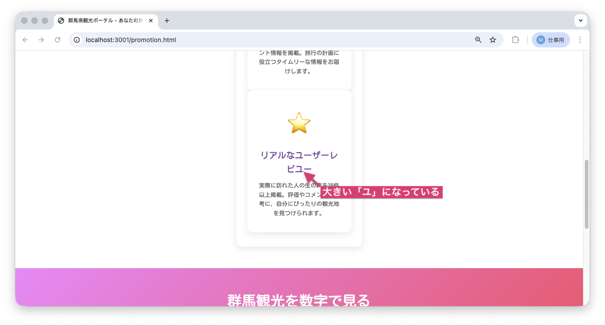
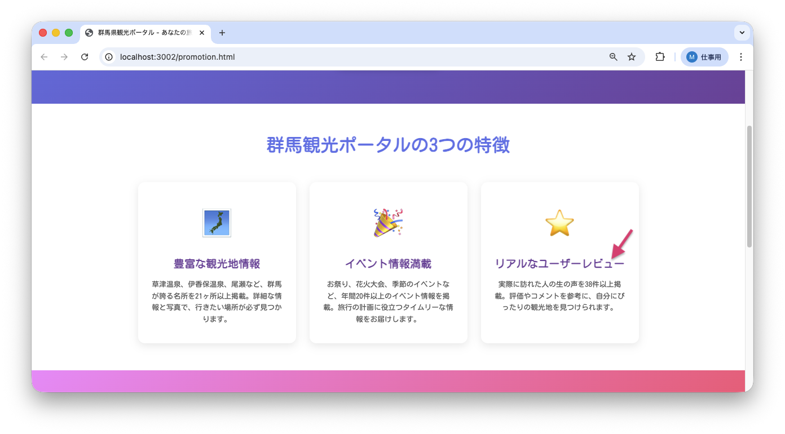

<!--
**姿勢 Attitude**
- より**具体的**に、明示する。Explain the issue **concretely**.
- **否定的**な言葉を使わなくても説明はできる。Explain the issue without **negative** sentence.
- 情報に**URL**があるならば書く。Write **URL** which indicates the information.
- 説明するよりも、**図示する**。**Image** is better than text.
 -->

## 画面・API (Page or API):
/promotion.html

## 問題の簡単な説明 (Explain the problem):
3つ目の特徴カードのタイトルに誤字があります。「リアルなユーザーレビユー」と表示されています。

## どうあるべきか (To be):
 - 「リアルなユーザーレビュー」と表示されるべきです。
 - 正しい日本語表記（長音記号「ー」を使用）である必要があります。

## 再現する手順 (Steps to reproduce the problem):
 1. ブラウザで `/promotion.html` にアクセスする
 2. 「群馬観光ポータルの3つの特徴」セクションまでスクロールする
 3. 3つ目のカード（⭐アイコン）のタイトルを確認する
 4. 「リアルなユーザーレビユー」と表示されていることを確認

## その他の情報 (Other information):
**該当コード箇所:**
`frontend/promotion.html` 226行目付近

```html
<div class="feature-card">
    <div class="feature-icon">⭐</div>
    <h3>リアルなユーザーレビユー</h3>
    <!-- ↑ 「ユ」を「ュ」に修正しましょう -->
    <p>実際に訪れた人の生の声を38件以上掲載。評価やコメントを参考に、自分にぴったりの観光地を見つけられます。</p>
</div>
```

**ヒント:**
- カタカナの長音記号の使い方を確認しましょう
- 「レビュー」が正しい表記です

**現在の画面:**


**正しいデザイン:**


---

## プルリクエスト (Pull Request):

修正が完了したら、プルリクエストを作成してください。

**必須ラベル:**
- `level_1/B`

**PRタイトル例:**
```
[Level 1-B] 問題の簡単な説明
```
