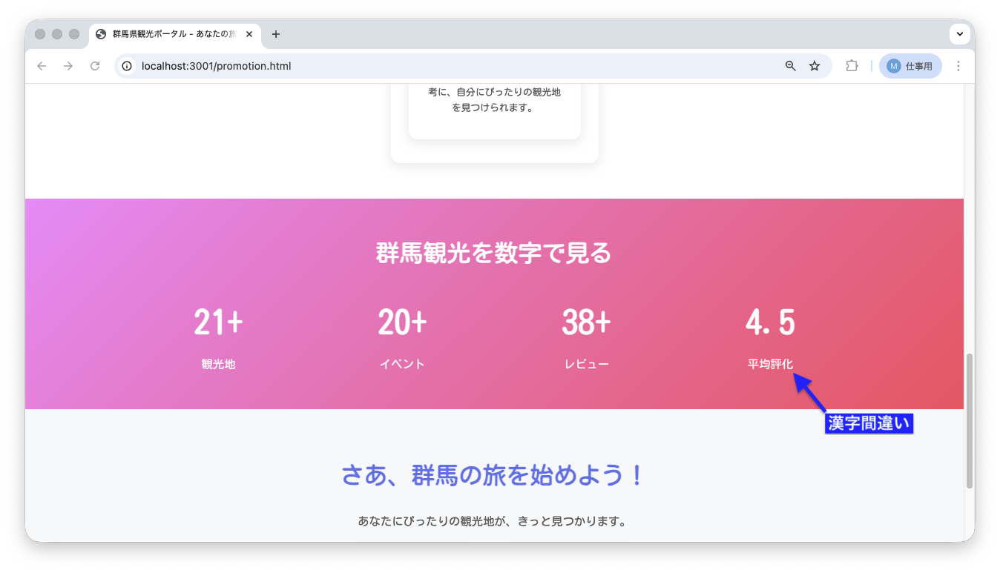
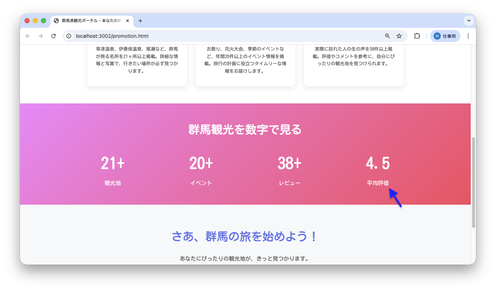

<!--
**姿勢 Attitude**
- より**具体的**に、明示する。Explain the issue **concretely**.
- **否定的**な言葉を使わなくても説明はできる。Explain the issue without **negative** sentence.
- 情報に**URL**があるならば書く。Write **URL** which indicates the information.
- 説明するよりも、**図示する**。**Image** is better than text.
 -->

## 画面・API (Page or API):
/promotion.html

## 問題の簡単な説明 (Explain the problem):
統計セクションの「平均評価」のラベルに誤字があります。「平均評化」と表示されています。

## どうあるべきか (To be):
 - 「平均評価」と表示されるべきです。
 - 正しい漢字表記である必要があります。

## 再現する手順 (Steps to reproduce the problem):
 1. ブラウザで `/promotion.html` にアクセスする
 2. 「群馬観光を数字で見る」セクションまでスクロールする
 3. 4つ目の統計項目（4.5と表示されている項目）のラベルを確認する
 4. 「平均評化」と表示されていることを確認

## その他の情報 (Other information):
**該当コード箇所:**
`frontend/promotion.html` 250行目付近

```html
<div class="stat-item">
    <div class="stat-number">4.5</div>
    <div class="stat-label">平均評化</div>
    <!-- ↑ 「化」を「価」に修正しましょう -->
</div>
```

**ヒント:**
- 「評価」が正しい表記です
- テキスト内容を修正しましょう

**現在の画面:**


**正しいデザイン:**


---

## プルリクエスト (Pull Request):

修正が完了したら、プルリクエストを作成してください。

**必須ラベル:**
- `level_1/C`

**PRタイトル例:**
```
[Level 1-C] 問題の簡単な説明
```
