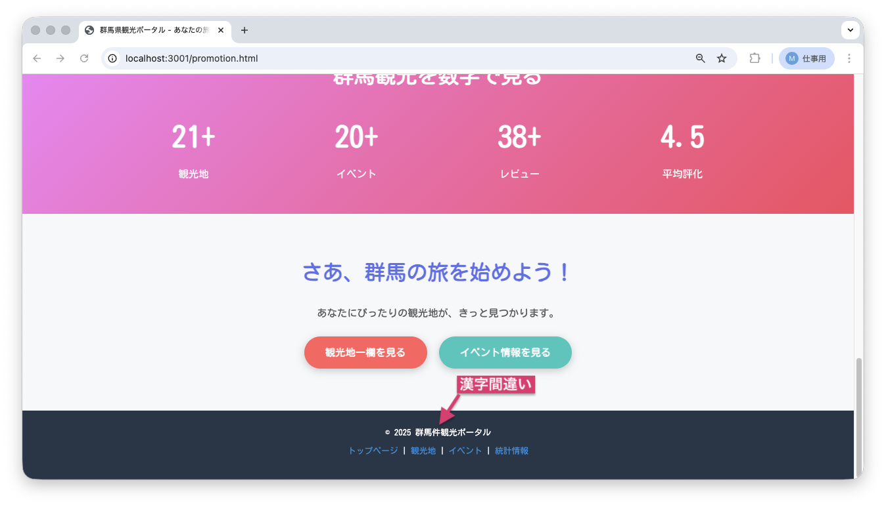
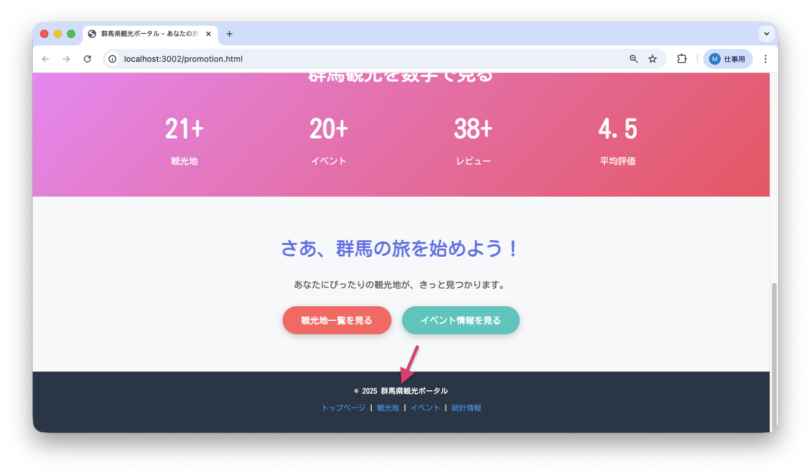

<!--
**姿勢 Attitude**
- より**具体的**に、明示する。Explain the issue **concretely**.
- **否定的**な言葉を使わなくても説明はできる。Explain the issue without **negative** sentence.
- 情報に**URL**があるならば書く。Write **URL** which indicates the information.
- 説明するよりも、**図示する**。**Image** is better than text.
 -->

## 画面・API (Page or API):
/promotion.html

## 問題の簡単な説明 (Explain the problem):
フッターの著作権表示に誤字があります。「群馬件観光ポータル」と表示されています。

## どうあるべきか (To be):
 - 「群馬県観光ポータル」と表示されるべきです。
 - 正しい漢字表記である必要があります。

## 再現する手順 (Steps to reproduce the problem):
 1. ブラウザで `/promotion.html` にアクセスする
 2. ページ最下部のフッターまでスクロールする
 3. 著作権表示を確認する
 4. 「© 2025 群馬件観光ポータル」と表示されていることを確認

## その他の情報 (Other information):
**該当コード箇所:**
`frontend/promotion.html` 267行目付近

```html
<footer>
    <p>&copy; 2025 群馬件観光ポータル</p>
    <!-- ↑ 「件」を「県」に修正しましょう -->
    <p>
        <a href="index.html">トップページ</a> |
        <a href="spots.html">観光地</a> |
        <a href="events.html">イベント</a> |
        <a href="stats.html">統計情報</a>
    </p>
</footer>
```

**ヒント:**
- 「群馬県」が正しい表記です
- 都道府県名の漢字を確認しましょう

**現在の画面:**


**正しいデザイン:**


---

## プルリクエスト (Pull Request):

修正が完了したら、プルリクエストを作成してください。

**必須ラベル:**
- `level_1/E`

**PRタイトル例:**
```
[Level 1-E] 問題の簡単な説明
```
