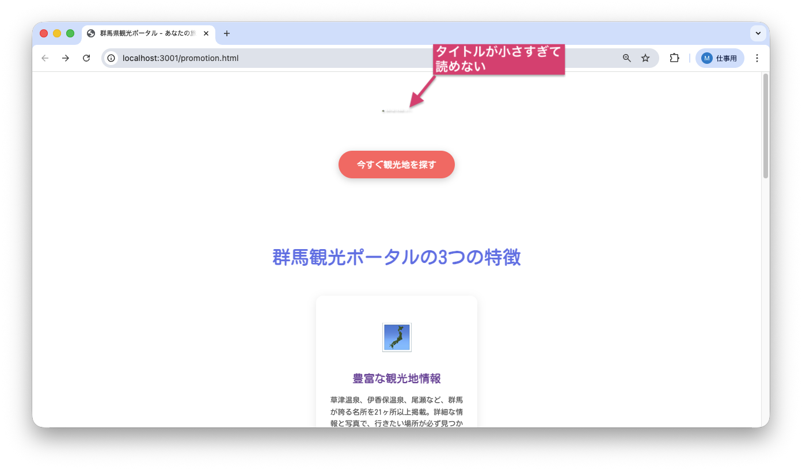
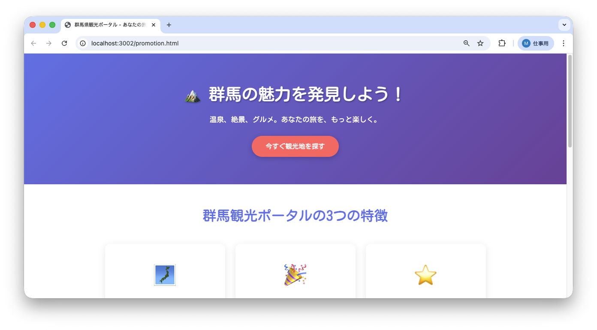

<!--
**姿勢 Attitude**
- より**具体的**に、明示する。Explain the issue **concretely**.
- **否定的**な言葉を使わなくても説明はできる。Explain the issue without **negative** sentence.
- 情報に**URL**があるならば書く。Write **URL** which indicates the information.
- 説明するよりも、**図示する**。**Image** is better than text.
 -->

## 画面・API (Page or API):
/promotion.html

## 問題の簡単な説明 (Explain the problem):
ページのメインタイトル「群馬の魅力を発見しよう！」が非常に小さく表示されており、読むことが困難です。

## どうあるべきか (To be):
 - メインタイトルは目立つように大きなフォントサイズ（2.5rem〜3rem程度）で表示されるべきです。
 - ユーザーが一目でタイトルを読めるようにする必要があります。

## 再現する手順 (Steps to reproduce the problem):
 1. ブラウザで `/promotion.html` にアクセスする
 2. ページ上部のヒーローセクション（メイン画像とタイトルのエリア）を確認する
 3. タイトル「🏔️ 群馬の魅力を発見しよう！」が極小サイズで表示されていることを確認

## その他の情報 (Other information):
**該当コード箇所:**
`frontend/promotion.html` 30行目付近

```css
.hero h1 {
    font-size: 0.3rem;  /* ← 現在の値 */
    margin-bottom: 20px;
    text-shadow: 2px 2px 4px rgba(0,0,0,0.3);
}
```

**ヒント:**
- CSSの `font-size` プロパティ（文字サイズの設定）の値を確認してみましょう
- 適切なサイズに変更することで解決できます

**現在の画面:**


**正しいデザイン:**


---

## プルリクエスト (Pull Request):

修正が完了したら、プルリクエストを作成してください。

**必須ラベル:**
- `level_1/F`

**PRタイトル例:**
```
[Level 1-F] 問題の簡単な説明
```
