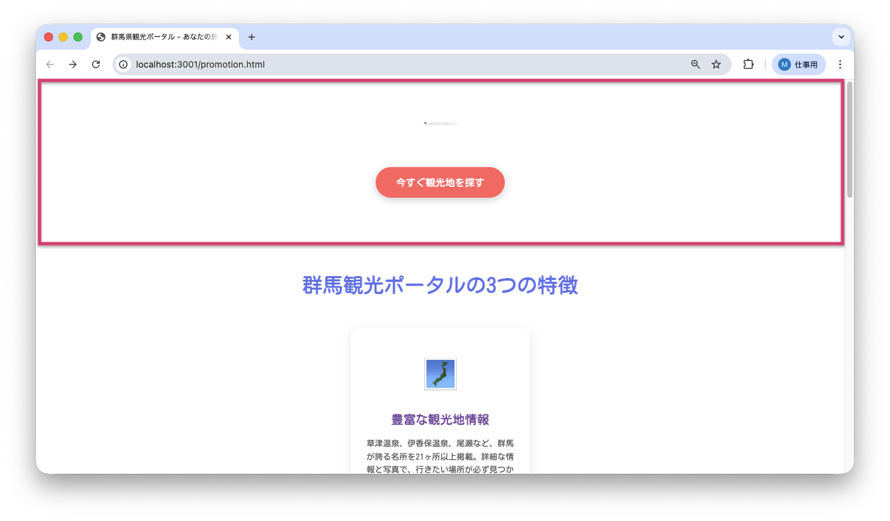

<!--
**姿勢 Attitude**
- より**具体的**に、明示する。Explain the issue **concretely**.
- **否定的**な言葉を使わなくても説明はできる。Explain the issue without **negative** sentence.
- 情報に**URL**があるならば書く。Write **URL** which indicates the information.
- 説明するよりも、**図示する**。**Image** is better than text.
 -->

## 画面・API (Page or API):
/promotion.html

## 問題の簡単な説明 (Explain the problem):
ヒーローセクションの背景グラデーションが正しく表示されていません。

## どうあるべきか (To be):
 - 美しい紫系のグラデーション背景（#667eea から #764ba2）が表示されるべきです。
 - 背景色は視覚的に魅力的に表示される必要があります。

## 再現する手順 (Steps to reproduce the problem):
 1. ブラウザで `/promotion.html` にアクセスする
 2. ページ上部のヒーローセクション（メイン画像とタイトルのエリア）の背景色を確認する
 3. グラデーションが意図した通りに表示されていないことを確認

## その他の情報 (Other information):
**該当コード箇所:**
`frontend/promotion.html` 23行目付近

```css
.hero {
    background: linear-gradient(135deg, #667ea 0%, #764ba2 100%);
    /* ↑ カラーコードを確認してみましょう */
    color: white;
    text-align: center;
    padding: 80px 20px;
}
```

**ヒント:**
- CSSのカラーコード（色の指定）は `#` の後に6桁の16進数（例: `#667eea`）で指定します
- 不完全なカラーコードがないか確認してみましょう

**現在の画面:**


**正しいデザイン:**


---

## プルリクエスト (Pull Request):

修正が完了したら、プルリクエストを作成してください。

**必須ラベル:**
- `level_1/G`

**PRタイトル例:**
```
[Level 1-G] 問題の簡単な説明
```
