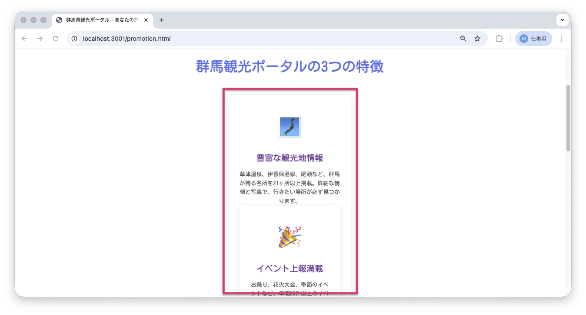
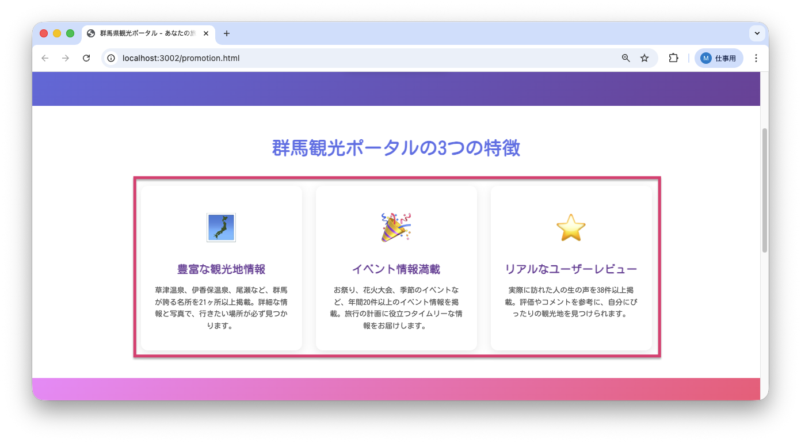

<!--
**姿勢 Attitude**
- より**具体的**に、明示する。Explain the issue **concretely**.
- **否定的**な言葉を使わなくても説明はできる。Explain the issue without **negative** sentence.
- 情報に**URL**があるならば書く。Write **URL** which indicates the information.
- 説明するよりも、**図示する**。**Image** is better than text.
 -->

## 画面・API (Page or API):
/promotion.html

## 問題の簡単な説明 (Explain the problem):
「群馬観光ポータルの3つの特徴」セクションのレイアウトが崩れています。カードが正しく表示されていません。

## どうあるべきか (To be):
 - 3つの特徴カードが横並びに綺麗に整列して表示されるべきです。
 - 各カードが同じスタイルで表示される必要があります。

## 再現する手順 (Steps to reproduce the problem):
 1. ブラウザで `/promotion.html` にアクセスする
 2. 「群馬観光ポータルの3つの特徴」セクションまでスクロールする
 3. 1つ目のカード「豊富な観光地情報」の表示が崩れていることを確認

## その他の情報 (Other information):
**該当コード箇所:**
`frontend/promotion.html` 212-216行目付近

```html
<div class="feature-card">
    <div class="feature-icon">🗾</div>
    <h3>豊富な観光地情報</h3>
    <p>草津温泉、伊香保温泉、尾瀬など、群馬が誇る名所を21ヶ所以上掲載。詳細な情報と写真で、行きたい場所が必ず見つかります。</p>
<!-- </div> を削除 -->
```

**ヒント:**
- HTML（ページの構造を作るコード）のタグは開始タグ `<div>` と終了タグ `</div>` がペアになっている必要があります
- 閉じタグが不足していないか確認してみましょう

**現在の画面:**


**正しいデザイン:**


---

## プルリクエスト (Pull Request):

修正が完了したら、プルリクエストを作成してください。

**必須ラベル:**
- `level_1/H`

**PRタイトル例:**
```
[Level 1-H] 問題の簡単な説明
```
