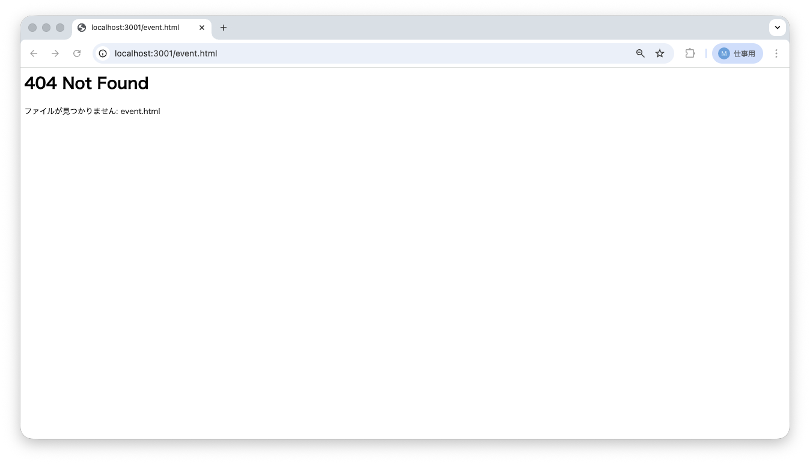
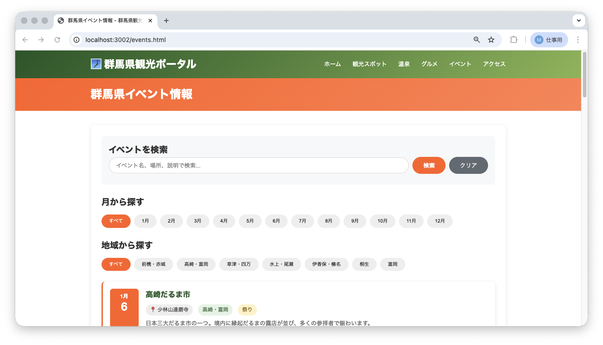

<!--
**姿勢 Attitude**
- より**具体的**に、明示する。Explain the issue **concretely**.
- **否定的**な言葉を使わなくても説明はできる。Explain the issue without **negative** sentence.
- 情報に**URL**があるならば書く。Write **URL** which indicates the information.
- 説明するよりも、**図示する**。**Image** is better than text.
 -->

## 画面・API (Page or API):
/promotion.html

## 問題の簡単な説明 (Explain the problem):
CTAセクション（ユーザーに行動を促すボタンエリア）の「イベント情報を見る」ボタンをクリックすると、404エラーが表示されます。

## どうあるべきか (To be):
 - ボタンをクリックするとイベント一覧ページ（events.html）に切り替わるべきです。
 - リンク先のファイル名が正しく設定されている必要があります。

## 再現する手順 (Steps to reproduce the problem):
 1. ブラウザで `/promotion.html` にアクセスする
 2. 「さあ、群馬の旅を始めよう！」セクションまでスクロールする
 3. 2つ目のボタン（青緑色の「イベント情報を見る」ボタン）をクリックする
 4. 404エラー（ページが見つかりません）が表示されることを確認

## その他の情報 (Other information):
**該当コード箇所:**
`frontend/promotion.html` 262行目付近

```html
<a href="event.html" class="cta-button" style="background: #4ecdc4; margin-left: 15px;">イベント情報を見る</a>
<!-- ↑ リンク先のファイル名を確認しましょう -->
```

**ヒント:**
- リンク先が `event.html` になっていますが、実際のファイル名は `events.html`（複数形）です
- HTMLの `href` 属性（リンク先の指定）の値を修正しましょう
- `frontend/` フォルダ内にどのファイルが存在するか確認してみましょう

**現在の画面:**


**正しいデザイン:**


---

## プルリクエスト (Pull Request):

修正が完了したら、プルリクエストを作成してください。

**必須ラベル:**
- `level_1/J`

**PRタイトル例:**
```
[Level 1-J] 問題の簡単な説明
```
