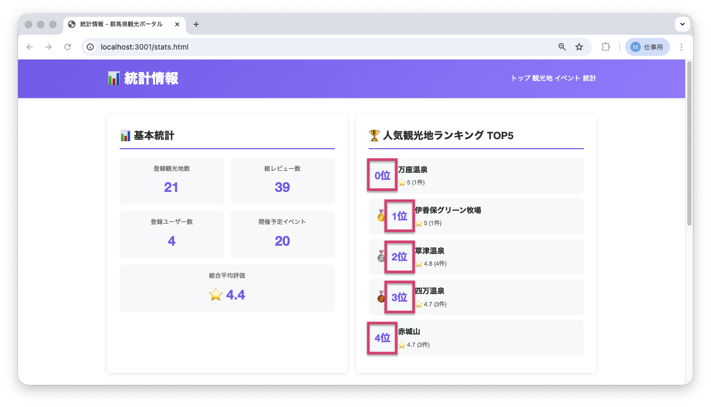
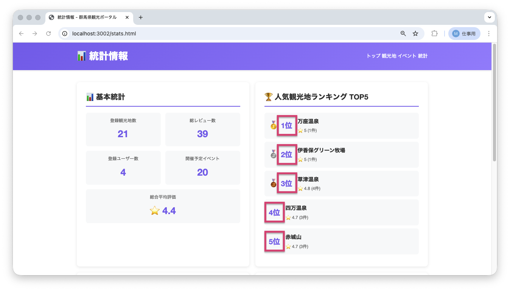

<!--
**姿勢 Attitude**
- より**具体的**に、明示する。Explain the issue **concretely**.
- **否定的**な言葉を使わなくても説明はできる。Explain the issue without **negative** sentence.
- 情報に**URL**があるならば書く。Write **URL** which indicates the information.
- 説明するよりも、**図示する**。**Image** is better than text.
 -->

## 画面・API (Page or API):
/stats.html

## 問題の簡単な説明 (Explain the problem):
統計ページの人気観光地ランキングで、順位が「0位」「1位」「2位」と表示されています。

## どうあるべきか (To be):
 - ランキングは「1位」「2位」「3位」のように1から始まるべきです。
 - 0位という表記は一般的ではありません。

## 再現する手順 (Steps to reproduce the problem):
 1. ブラウザで `/stats.html` にアクセスする
 2. 「人気観光地ランキング」セクションを確認する
 3. 順位が0位から始まっていることを確認

## その他の情報 (Other information):
**該当コード箇所:**
`frontend/stats.js` 62行目付近

```javascript
function displayTopSpots(spots) {
    const listElement = document.getElementById('topSpotsList');
    // ...
    spots.forEach((spot, index) => {
        const rank = index; // 0から始まっている
        const medal = getMedal(rank);
        // ...
        item.innerHTML = `
            ${medal ? `<span class="ranking-medal">${medal}</span>` : ''}
            <span class="ranking-number">${rank}位</span>
            // ...
        `;
    });
}
```

**ヒント:**
- JavaScriptの配列（リスト）の`forEach`メソッド（繰り返し処理）の`index`（番号）は0から始まります
- ランキングを1から始めるには、`index + 1`とする必要があります

**現在の画面:**


**正しいデザイン:**


---

## プルリクエスト (Pull Request):

修正が完了したら、プルリクエストを作成してください。

**必須ラベル:**
- `level_2/A`

**PRタイトル例:**
```
[Level 2-A] 問題の簡単な説明
```
