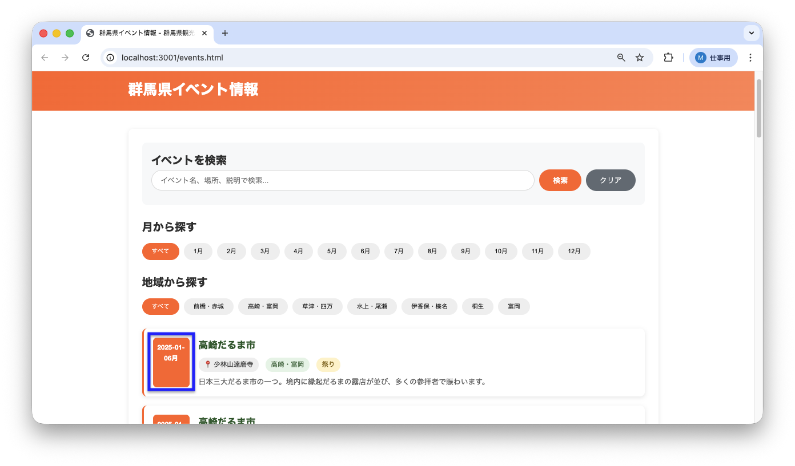
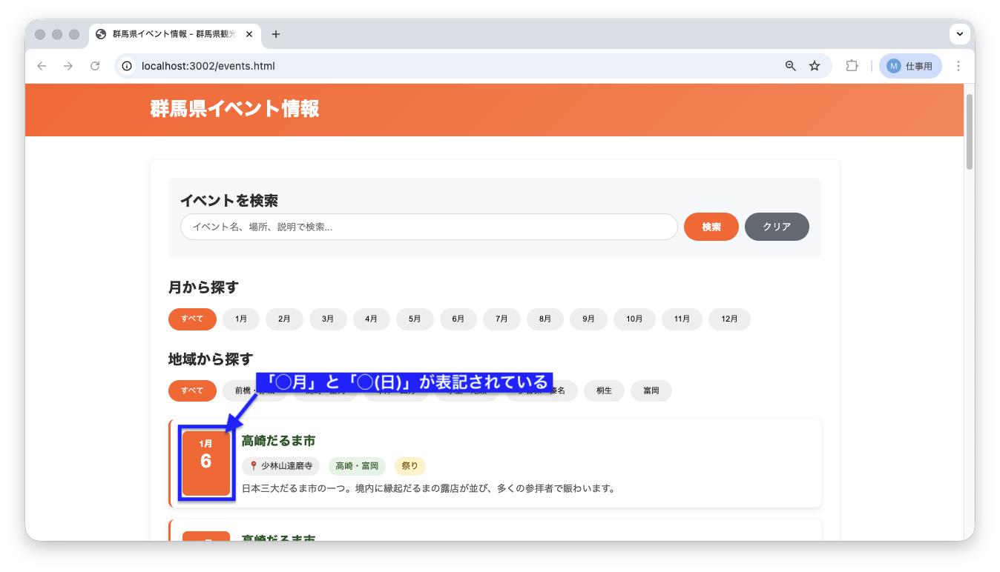

<!--
**姿勢 Attitude**
- より**具体的**に、明示する。Explain the issue **concretely**.
- **否定的**な言葉を使わなくても説明はできる。Explain the issue without **negative** sentence.
- 情報に**URL**があるならば書く。Write **URL** which indicates the information.
- 説明するよりも、**図示する**。**Image** is better than text.
 -->

## 画面・API (Page or API):
/events.html

## 問題の簡単な説明 (Explain the problem):
イベント一覧ページで、各イベントの開催日が「2025-08-15」のようなデータベース形式のまま表示されています。

## どうあるべきか (To be):
 - イベントの開催日は「8月15日」のように、月と日が分かれて見やすく表示されるべきです。
 - 左側の日付ボックスに「8月」と「15」が分かれて表示される必要があります。

## 再現する手順 (Steps to reproduce the problem):
 1. ブラウザで `/events.html` にアクセスする
 2. イベント一覧を確認する
 3. 各イベントカードの左側の日付ボックスを見る
 4. 「2025-08-15月」のような形式で表示されていることを確認

## その他の情報 (Other information):
**該当コード箇所:**
`frontend/events.js` 40-42行目付近

```javascript
function displayEvents(events) {
    // ...
    events.forEach(event => {
        // 日付をパース（変換）せずにそのまま表示している
        const month = event.event_date;
        const day = '';
        // ...
    });
}
```

**ヒント:**
- `event.event_date` は "2025-08-15" のような文字列です
- JavaScriptの `Date` オブジェクト（日付を扱う仕組み）を使って日付をパース（変換）できます
- `new Date(event.event_date).getMonth() + 1` で月を取得できます（0始まりなので+1が必要）
- `new Date(event.event_date).getDate()` で日を取得できます

**現在の画面:**


**正しいデザイン:**


---

## プルリクエスト (Pull Request):

修正が完了したら、プルリクエストを作成してください。

**必須ラベル:**
- `level_2/B`

**PRタイトル例:**
```
[Level 2-B] 問題の簡単な説明
```
