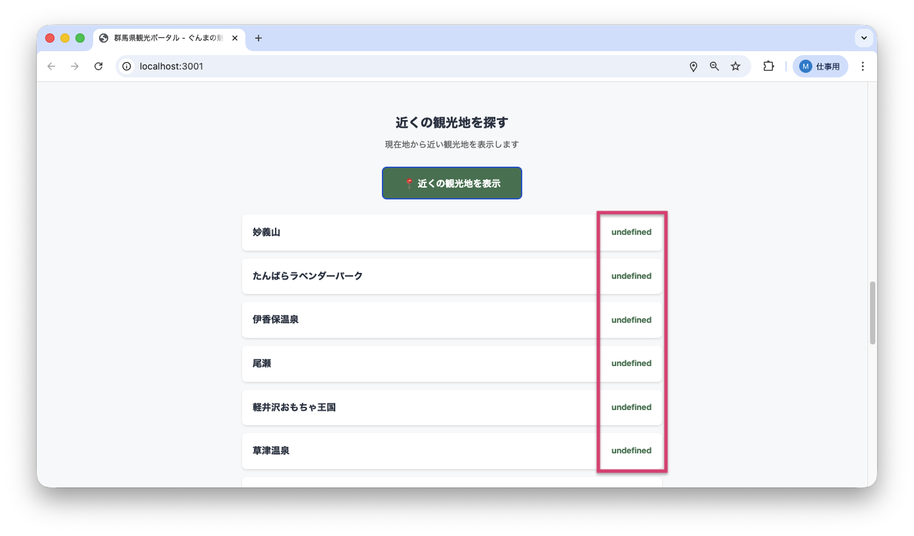
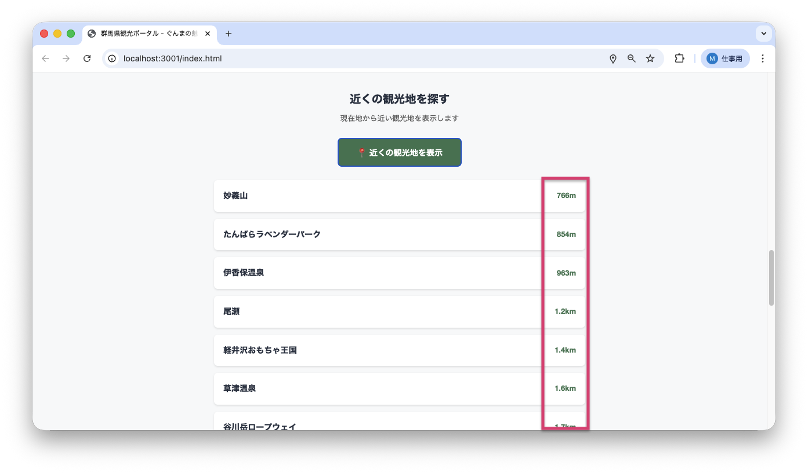

<!--
**姿勢 Attitude**
- より**具体的**に、明示する。Explain the issue **concretely**.
- **否定的**な言葉を使わなくても説明はできる。Explain the issue without **negative** sentence.
- 情報に**URL**があるならば書く。Write **URL** which indicates the information.
- 説明するよりも、**図示する**。**Image** is better than text.
 -->

## 画面・API (Page or API):
/index.html（近隣の観光地表示機能）

## 問題の簡単な説明 (Explain the problem):
「近くの観光地」機能で、観光地までの距離が正しく表示されません。距離を計算する関数`formatDistance()` が値を返していないため、「undefined」と表示されてしまいます。

## どうあるべきか (To be):
 - 距離が適切な単位（メートルまたはキロメートル）で表示されるべきです。
 - 1000m以上の場合は「○○km」、1000m未満の場合は「○○m」と表示される必要があります。
 - 例: 500mの場合 → "500m"、1500mの場合 → "1.5km"

## 再現する手順 (Steps to reproduce the problem):
 1. ブラウザで `/index.html` にアクセスする
 2. ページを下にスクロールして「近くの観光地を探す」セクションを表示する
 3. 「📍 近くの観光地を表示」ボタンをクリックする
 4. 位置情報の使用を許可する
 5. 観光地のリストが表示されるが、距離の部分に「undefined」と表示される
 6. ブラウザの開発者ツールのコンソールに警告やエラーは表示されない（文法エラーではない）

## その他の情報 (Other information):
**該当コード箇所:**
`frontend/api-client.js` の `formatDistance` 関数（267-275行目）

```javascript
/**
 * 距離をフォーマット（整形）する（m → km変換）
 * Issue C のバグ: return文が抜けている
 * @param {number} meters - メートル単位の距離
 * @returns {string} フォーマットされた距離文字列
 */
function formatDistance(meters) {
    if (meters >= 1000) {
        // バグ: return文がない
        (meters / 1000).toFixed(1) + 'km';
    } else {
        // バグ: return文がない
        meters + 'm';
    }
}
```

**使用箇所:**
この関数は `frontend/index.html` の `showNearbySpots` 関数（414-465行目）から呼び出されています。
```javascript
spots.forEach(spot => {
    // Issue C のバグ: formatDistance関数がundefinedを返す
    const distance = formatDistance(spot.distance);
    html += `
        <div class="nearby-spot-item">
            <div class="nearby-spot-name">${spot.spot_name}</div>
            <div class="nearby-spot-distance">${distance}</div>
        </div>
    `;
});
```

**問題点:**
- 関数内で値を計算しているが、`return` キーワードが抜けている
- JavaScriptでは `return` がない場合、関数は `undefined` を返す
- 文法エラーではないため、コンソール（ブラウザの開発者ツールでエラーを確認できる場所）にエラーが表示されない

**修正方法:**
各分岐に `return` キーワードを追加する

```javascript
function formatDistance(meters) {
    if (meters >= 1000) {
        return (meters / 1000).toFixed(1) + 'km';  // ← return を追加
    } else {
        return meters + 'm';  // ← return を追加
    }
}
```

**デバッグ（問題を見つけて修正する作業）のヒント:**
1. ブラウザの開発者ツールのコンソールで、関数を直接呼び出してテストできます:
   ```javascript
   console.log(formatDistance(500));   // → "500m" になるべき
   console.log(formatDistance(1500));  // → "1.5km" になるべき
   ```
2. 現在は両方とも `undefined` が返ってくることを確認できます

**参考リンク:**
- MDN - return文: https://developer.mozilla.org/ja/docs/Web/JavaScript/Reference/Statements/return
- MDN - 関数の戻り値: https://developer.mozilla.org/ja/docs/Learn/JavaScript/Building_blocks/Return_values

**現在の動作:**
- 「近くの観光地を表示」をクリックすると、観光地のリストが表示される
- しかし距離の部分に "undefined" と表示される
- `formatDistance(1500)` → `undefined`

**正しい動作:**
- 観光地のリストが表示され、距離が正しくフォーマット（整形）される
- 例: "草津温泉" の右側に "1.5km" と表示される
- `formatDistance(1500)` → `"1.5km"`

**現在の画面:**


**正しいデザイン:**


---

## プルリクエスト (Pull Request):

修正が完了したら、プルリクエストを作成してください。

**必須ラベル:**
- `level_2/C`

**PRタイトル例:**
```
[Level 2-C] 問題の簡単な説明
```
