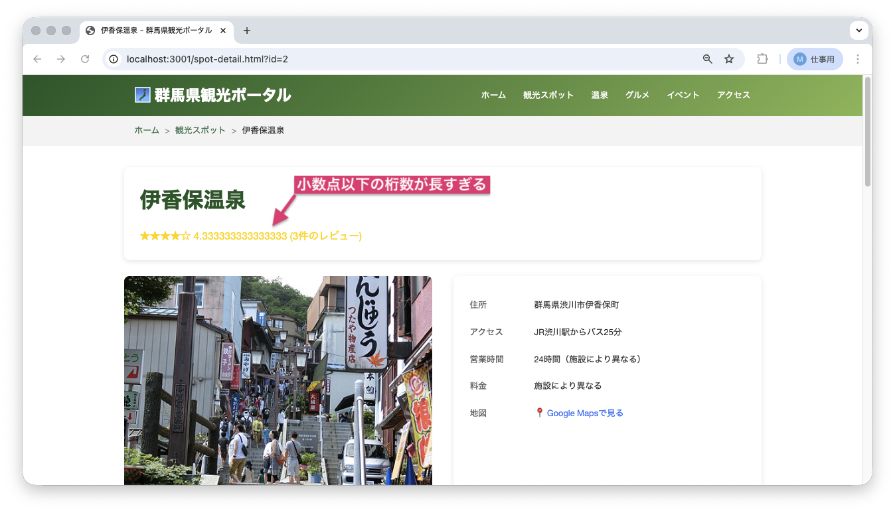
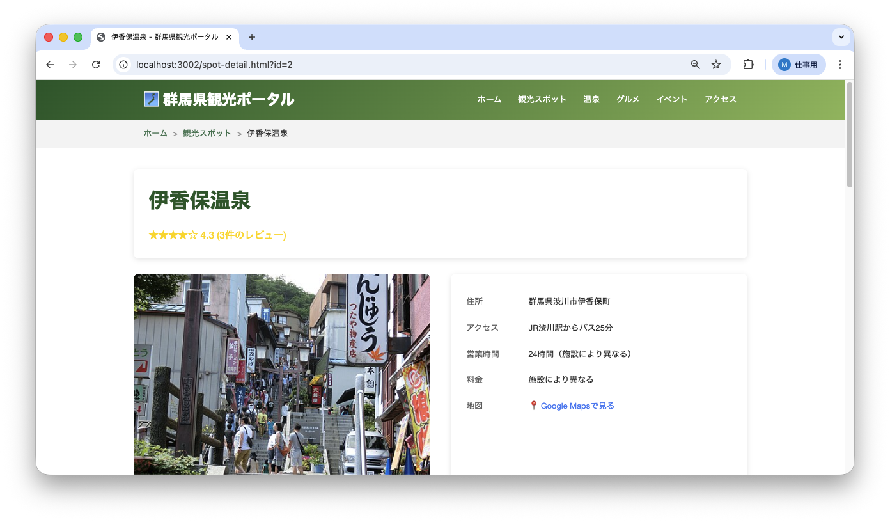

<!--
**姿勢 Attitude**
- より**具体的**に、明示する。Explain the issue **concretely**.
- **否定的**な言葉を使わなくても説明はできる。Explain the issue without **negative** sentence.
- 情報に**URL**があるならば書く。Write **URL** which indicates the information.
- 説明するよりも、**図示する**。**Image** is better than text.
 -->

## 画面・API (Page or API):
/spot-detail.html

## 問題の簡単な説明 (Explain the problem):
観光地詳細ページの平均評価が「⭐ 4.666666667 (3件のレビュー)」のように、小数点以下が長すぎて表示されています。

## どうあるべきか (To be):
 - 平均評価は小数点第1位まで表示されるべきです（例: 4.7）。
 - 見やすく整った表示にする必要があります。

## 再現する手順 (Steps to reproduce the problem):
 1. ブラウザで `/spots.html` にアクセスする
 2. 任意の観光地をクリックして詳細ページに移動する
 3. ページ上部のタイトル下にある平均評価を確認する
 4. 小数点以下が長く表示されていることを確認

## その他の情報 (Other information):
**該当コード箇所:**
`frontend/spot-detail.js` 62行目付近

```javascript
// 平均評価を表示
const fullStars = Math.floor(spot.avg_rating);
const hasHalfStar = spot.avg_rating % 1 >= 0.5;
const emptyStars = 5 - fullStars - (hasHalfStar ? 1 : 0);
const starsHtml = '★'.repeat(fullStars) + (hasHalfStar ? '☆' : '') + '☆'.repeat(emptyStars);
const ratingText = spot.review_count > 0 ? `${starsHtml} ${spot.avg_rating} (${spot.review_count}件のレビュー)` : '評価なし';
```

**ヒント:**
- JavaScriptの `.toFixed(1)` メソッド（小数点を指定した桁数に揃える処理）を使うと、小数点第1位まで表示できます
- 例: `(4.666666667).toFixed(1)` → `"4.7"`

**現在の画面:**


**正しいデザイン:**


---

## プルリクエスト (Pull Request):

修正が完了したら、プルリクエストを作成してください。

**必須ラベル:**
- `level_2/D`

**PRタイトル例:**
```
[Level 2-D] 問題の簡単な説明
```
