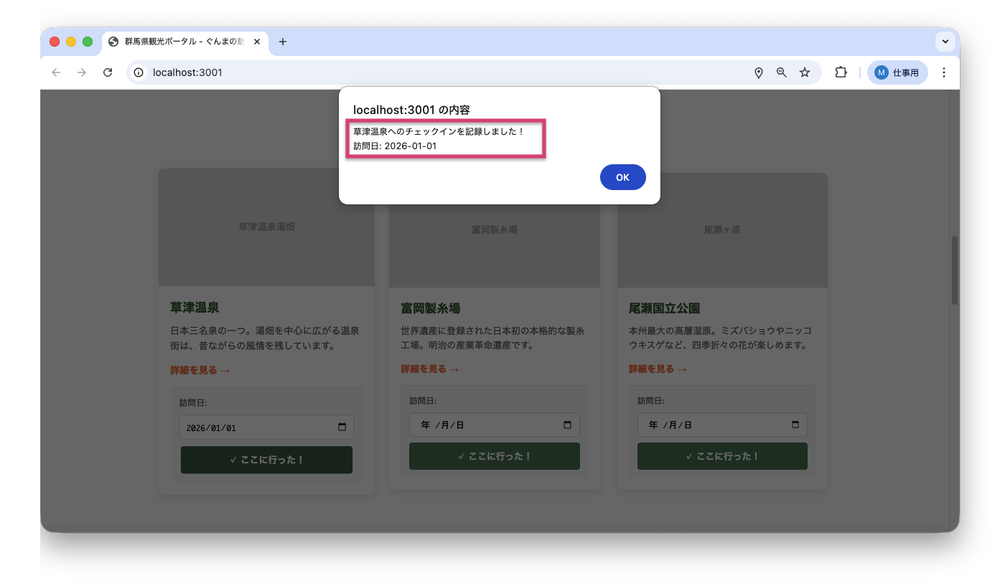
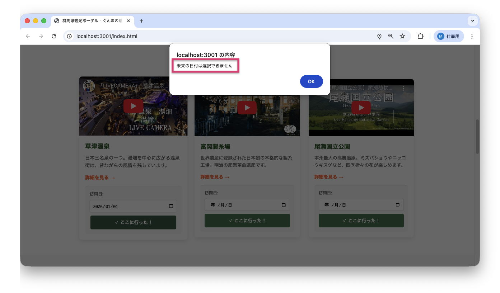

<!--
**姿勢 Attitude**
- より**具体的**に、明示する。Explain the issue **concretely**.
- **否定的**な言葉を使わなくても説明はできる。Explain the issue without **negative** sentence.
- 情報に**URL**があるならば書く。Write **URL** which indicates the information.
- 説明するよりも、**図示する**。**Image** is better than text.
 -->

## 画面・API (Page or API):
/index.html

## 問題の簡単な説明 (Explain the problem):
トップページの「人気の観光スポット」セクションにあるチェックイン機能で、未来の日付でもチェックインできてしまいます。本来は過去または今日の日付のみを許可すべきです。

## どうあるべきか (To be):
 - 未来の日付を選択した場合、エラーメッセージを表示してチェックインを拒否する必要があります
 - エラーメッセージ：「未来の日付は選択できません」
 - 今日または過去の日付のみチェックインを許可するべきです

## 再現する手順 (Steps to reproduce the problem):
 1. ブラウザで `/index.html` にアクセスする
 2. ページを下にスクロールして「人気の観光スポット」セクションを表示する
 3. いずれかの観光地カード（草津温泉、富岡製糸場、尾瀬国立公園）のチェックイン機能を確認
 4. 「訪問日」に未来の日付（例：2025年12月31日）を選択する
 5. 「✓ ここに行った！」ボタンをクリックする
 6. エラーが表示されず、未来の日付でチェックインが記録されてしまう
 7. 緑色の履歴表示に未来の日付が表示される

## その他の情報 (Other information):
**該当コード箇所:**
`frontend/index.html` の `checkIn` 関数（`<script>` タグ内）

```javascript
function checkIn(spotName, spotId) {
    const dateInput = document.getElementById(`visit-date-${spotId}`);
    const selectedDate = dateInput.value;

    // バグ1: 日付が選択されていないかチェックしていない
    // バグ2: 未来の日付かどうかをチェックしていない

    if (selectedDate) {
        // localStorageに保存
        const checkinData = {
            spot: spotName,
            date: selectedDate,
            checkedAt: new Date().toISOString()
        };

        localStorage.setItem(`checkin_${spotId}`, JSON.stringify(checkinData));
        alert(`${spotName}へのチェックインを記録しました！\n訪問日: ${selectedDate}`);
        dateInput.value = '';
        updateCheckinDisplay(spotId);
    } else {
        alert('訪問日を選択してください');
    }
}
```

**問題点:**
- 選択された日付が未来かどうかをチェックしていない
- `Date` オブジェクト（JavaScriptで日付を扱うためのデータ型）を使った日付の比較が実装されていない

**修正方法:**
1. 選択された日付を `Date` オブジェクトに変換
2. 今日の日付を取得（データを読み込んで使えるようにする）
3. 選択された日付が今日より未来かどうかを比較
4. 未来の場合はエラーメッセージを表示して処理を中断

```javascript
function checkIn(spotName, spotId) {
    const dateInput = document.getElementById(`visit-date-${spotId}`);
    const selectedDate = dateInput.value;

    if (!selectedDate) {
        alert('訪問日を選択してください');
        return;
    }

    // 日付バリデーション（入力チェック）: 未来の日付をチェック
    const selected = new Date(selectedDate);
    const today = new Date();
    today.setHours(0, 0, 0, 0);  // 時刻をリセットして日付のみで比較

    if (selected > today) {
        alert('未来の日付は選択できません');
        return;
    }

    // チェックイン処理
    const checkinData = {
        spot: spotName,
        date: selectedDate,
        checkedAt: new Date().toISOString()
    };

    localStorage.setItem(`checkin_${spotId}`, JSON.stringify(checkinData));
    alert(`${spotName}へのチェックインを記録しました！\n訪問日: ${selectedDate}`);
    dateInput.value = '';
    updateCheckinDisplay(spotId);
}
```

**ヒント:**
- JavaScriptの `Date` オブジェクトを使って日付の比較ができます
- `new Date(dateString)` で文字列から Date オブジェクトを作成できます
- `setHours(0, 0, 0, 0)` で時刻部分をリセットすると、日付のみで正確に比較できます
- Date オブジェクトは `>`, `<`, `>=`, `<=` 演算子で直接比較できます

**参考リンク:**
- MDN - Date: https://developer.mozilla.org/ja/docs/Web/JavaScript/Reference/Global_Objects/Date
- MDN - Date comparisons: https://developer.mozilla.org/ja/docs/Web/JavaScript/Reference/Global_Objects/Date#date_comparisons

**現在の動作:**
- 未来の日付（2025-12-31）を選択 → チェックインが成功してしまう
- 履歴表示：「✓ 2025-12-31 に訪問済み」と表示される

**正しい動作:**
- 未来の日付（2025-12-31）を選択 → エラーメッセージ「未来の日付は選択できません」が表示される
- チェックインは記録されない
- 今日または過去の日付のみチェックインが成功する

**現在の画面:**


**正しいデザイン:**


---

## プルリクエスト (Pull Request):

修正が完了したら、プルリクエストを作成してください。

**必須ラベル:**
- `level_2/F`

**PRタイトル例:**
```
[Level 2-F] 問題の簡単な説明
```
