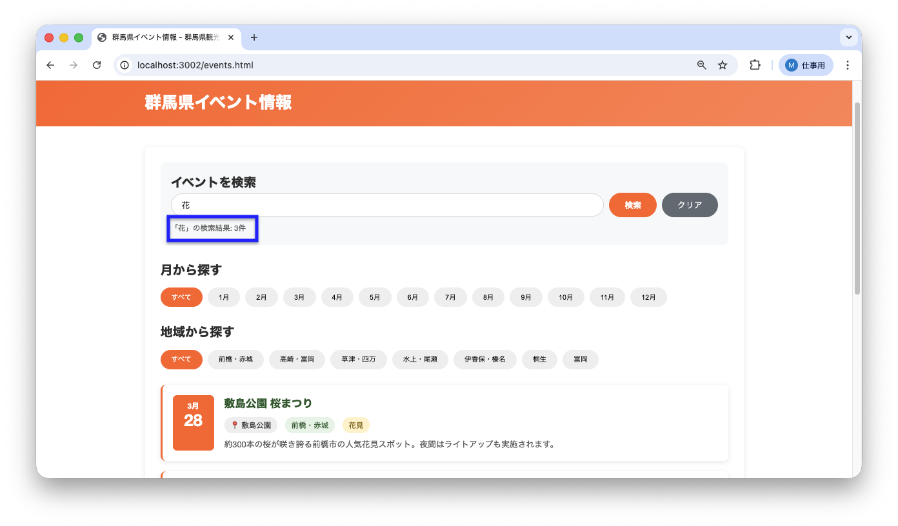

<!--
**姿勢 Attitude**
- より**具体的**に、明示する。Explain the issue **concretely**.
- **否定的**な言葉を使わなくても説明はできる。Explain the issue without **negative** sentence.
- 情報に**URL**があるならば書く。Write **URL** which indicates the information.
- 説明するよりも、**図示する**。**Image** is better than text.
 -->

## 画面・API (Page or API):
/events.html

## 問題の簡単な説明 (Explain the problem):
イベント検索機能を使った後、検索結果が何件見つかったかの情報が表示されません。

## どうあるべきか (To be):
 - 検索ボックスの下に検索結果件数が表示されるべきです。
 - 表示形式は以下のいずれかで構いません：
   - 「〇〇件見つかりました」（例：「5件見つかりました」）
   - 「『キーワード』の検索結果：〇〇件」（例：「『まつり』の検索結果：5件」）
 - ユーザーが検索結果の件数を一目で確認できる必要があります。

## 再現する手順 (Steps to reproduce the problem):
 1. ブラウザで `/events.html` にアクセスする
 2. 検索ボックスに「まつり」と入力する
 3. 「検索」ボタンをクリックする
 4. 検索結果が表示されるが、件数の表示がないことを確認

## その他の情報 (Other information):
**該当コード箇所:**
`frontend/events.js` 154-155行目付近

```javascript
async function searchEvents() {
    const searchInput = document.getElementById('searchInput');
    const keyword = searchInput.value.trim();
    const searchResultInfo = document.getElementById('searchResultInfo');

    if (!keyword) {
        searchResultInfo.textContent = 'キーワードを入力してください';
        return;
    }

    try {
        const results = await apiClient.searchEvents(keyword);
        displayEvents(results);
        // 検索結果件数を表示する処理が必要
    } catch (error) {
        console.error('検索エラー:', error);
        searchResultInfo.textContent = '検索に失敗しました';
    }
}
```

**ヒント:**
- `searchResultInfo` 要素（HTML上の表示部品）の `textContent` プロパティ（要素が持つ設定項目の一つ）に検索結果の情報を設定する必要があります
- テンプレートリテラル（文字列の中に変数の値を埋め込む方法）を使って、キーワードと件数を含めた文字列を作成しましょう
- 例: `searchResultInfo.textContent = \`「${keyword}」の検索結果: ${results.length}件\`;`

**現在の画面:**


**正しいデザイン:**


---

## プルリクエスト (Pull Request):

修正が完了したら、プルリクエストを作成してください。

**必須ラベル:**
- `level_2/G`

**PRタイトル例:**
```
[Level 2-G] 問題の簡単な説明
```
