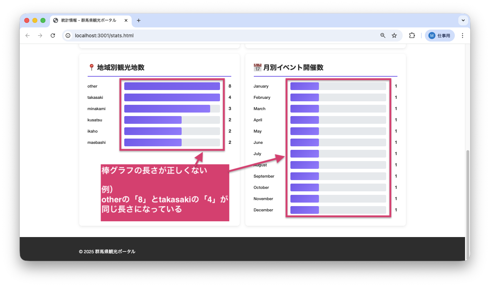
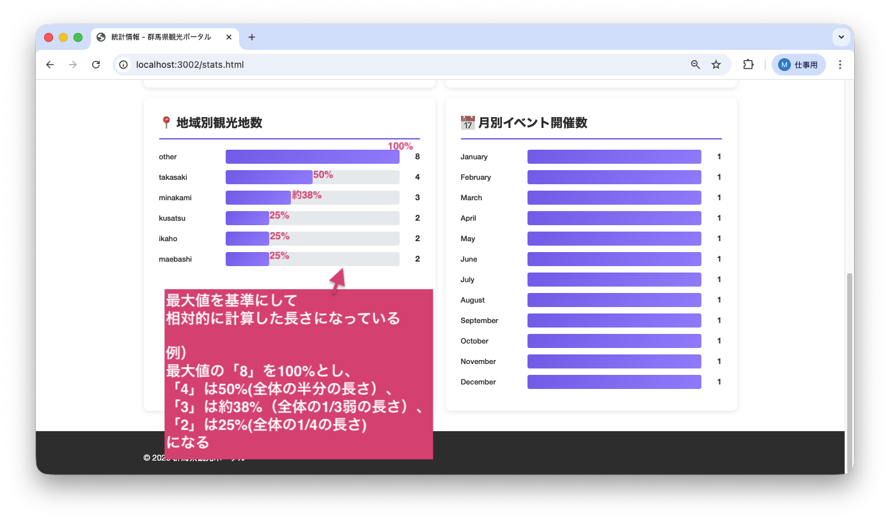

<!--
**姿勢 Attitude**
- より**具体的**に、明示する。Explain the issue **concretely**.
- **否定的**な言葉を使わなくても説明はできる。Explain the issue without **negative** sentence.
- 情報に**URL**があるならば書く。Write **URL** which indicates the information.
- 説明するよりも、**図示する**。**Image** is better than text.
 -->

## 画面・API (Page or API):
/stats.html

## 問題の簡単な説明 (Explain the problem):
統計ページの棒グラフで、データの幅が正しく表示されていません。例えば、1件のデータでも30%の幅で表示されてしまいます。

## どうあるべきか (To be):
 - 棒グラフの幅は、最大値を基準に相対的（他の値との比較で決まる）に計算されるべきです。
 - 最大値のデータが100%の幅で表示され、他のデータはその比率で表示される必要があります。
 - 例: 最大値が10件の場合、5件のデータは50%の幅で表示されるべきです。

## 再現する手順 (Steps to reproduce the problem):
 1. ブラウザで `/stats.html` にアクセスする
 2. 「地域別観光地数」または「月別イベント開催数」のグラフを確認する
 3. 1件のデータでも30%程度の幅で表示されていることを確認
 4. 件数とグラフの幅が比例していないことを確認

## その他の情報 (Other information):
**該当コード箇所:**
`frontend/stats.js` 144行目付近

```javascript
function createBarChartItem(label, value, maxValue) {
    const barItem = document.createElement('div');
    barItem.className = 'bar-chart-item';

    const widthPercent = value * 30; // 最大値を使っていない（1件でも30%になる）

    barItem.innerHTML = `
        <span class="bar-chart-label">${escapeHtml(label)}</span>
        <div class="bar-chart-bar-container">
            <div class="bar-chart-bar" style="width: ${widthPercent}%"></div>
        </div>
        <span class="bar-chart-value">${value}</span>
    `;

    return barItem;
}
```

**ヒント:**
- 関数の引数（関数に渡される入力値）に`maxValue`が渡されていますが、使われていません
- 正しい幅の計算式は `(value / maxValue) * 100` です
- これにより、最大値が100%、その他は比率に応じた幅になります

**現在の画面:**


**正しいデザイン:**


---

## プルリクエスト (Pull Request):

修正が完了したら、プルリクエストを作成してください。

**必須ラベル:**
- `level_2/H`

**PRタイトル例:**
```
[Level 2-H] 問題の簡単な説明
```
