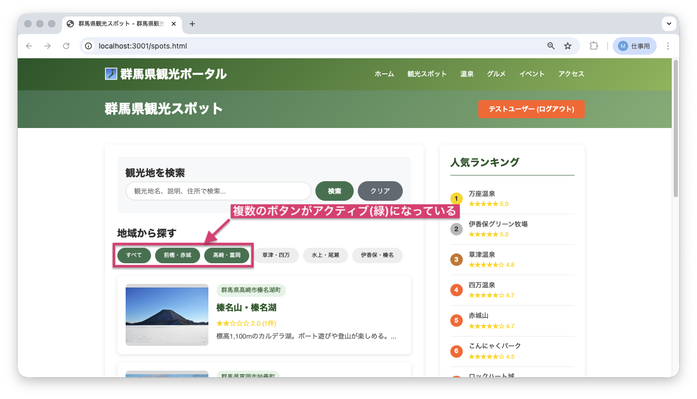
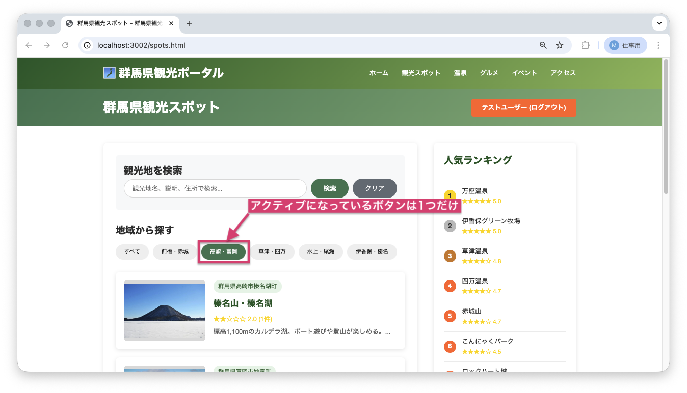

<!--
**姿勢 Attitude**
- より**具体的**に、明示する。Explain the issue **concretely**.
- **否定的**な言葉を使わなくても説明はできる。Explain the issue without **negative** sentence.
- 情報に**URL**があるならば書く。Write **URL** which indicates the information.
- 説明するよりも、**図示する**。**Image** is better than text.
 -->

## 画面・API (Page or API):
/spots.html

## 問題の簡単な説明 (Explain the problem):
地域フィルターボタンを複数回クリックすると、複数のボタンがアクティブ（緑色）になってしまいます。

## どうあるべきか (To be):
 - 地域フィルターボタンは、常に1つだけがアクティブになるべきです。
 - 新しいボタンをクリックしたら、前のボタンのアクティブ状態は解除されるべきです。

## 再現する手順 (Steps to reproduce the problem):
 1. ブラウザで `/spots.html` にアクセスする
 2. 「地域から探す」セクションで「前橋・赤城」ボタンをクリックする
 3. 次に「高崎・富岡」ボタンをクリックする
 4. 両方のボタンがアクティブ（緑色）になっていることを確認

## その他の情報 (Other information):
**該当コード箇所:**
`frontend/spots.js` 292-299行目付近

```javascript
function filterByArea(area, clickedButton) {
    const spotItems = document.querySelectorAll('.spot-item');
    const areaButtons = document.querySelectorAll('.area-btn');

    // ここに前のボタンのactiveクラスを削除する処理が必要

    if (clickedButton) {
        clickedButton.classList.add('active');
    }
    // ...
}
```

**ヒント:**
- 全てのボタンから`active`クラスを削除してから、クリックされたボタンに`active`クラスを追加する必要があります
- `querySelectorAll()`メソッドで取得した全てのボタンをループして、`classList.remove('active')`を実行しましょう

**現在の画面:**


**正しいデザイン:**


---

## プルリクエスト (Pull Request):

修正が完了したら、プルリクエストを作成してください。

**必須ラベル:**
- `level_2/I`

**PRタイトル例:**
```
[Level 2-I] 問題の簡単な説明
```
