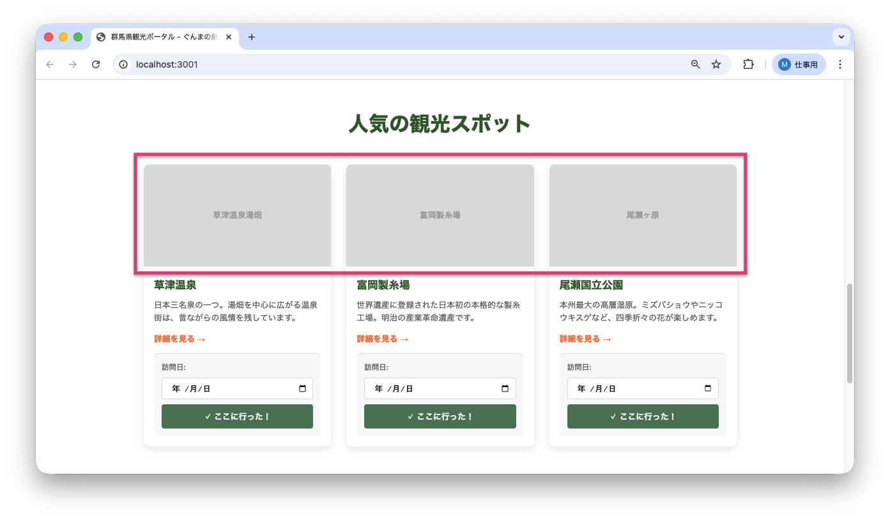
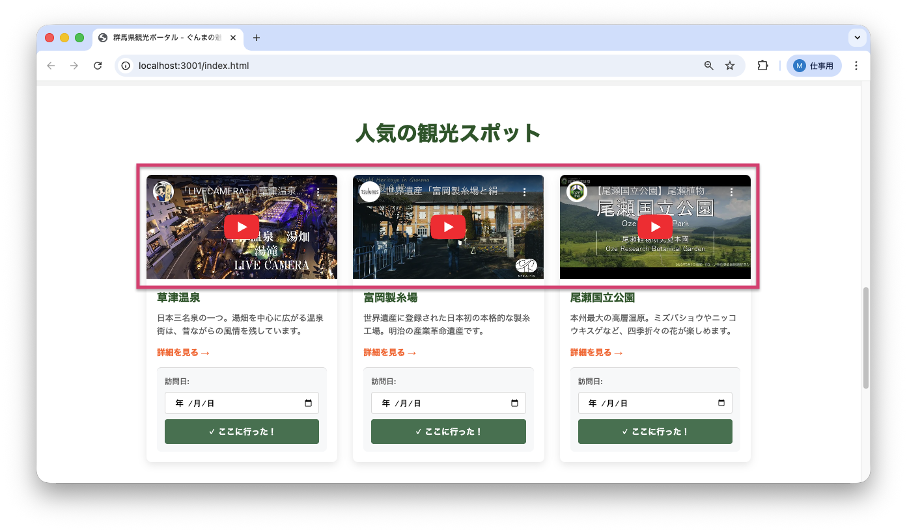

<!--
**姿勢 Attitude**
- より**具体的**に、明示する。Explain the issue **concretely**.
- **否定的**な言葉を使わなくても説明はできる。Explain the issue without **negative** sentence.
- 情報に**URL**があるならば書く。Write **URL** which indicates the information.
- 説明するよりも、**図示する**。**Image** is better than text.
 -->

## 画面・API (Page or API):
/index.html

## 問題の簡単な説明 (Explain the problem):
トップページの「人気の観光スポット」セクションに、観光地の紹介動画を埋め込みたいという要望があります。現在は静的な画像プレースホルダー（仮の表示）が表示されていますが、これをYouTube動画の埋め込みに変更してください。

## どうあるべきか (To be):
 - 「人気の観光スポット」セクションの各スポットカード（草津温泉、富岡製糸場、尾瀬国立公園）に、YouTube動画が埋め込まれて表示されるべきです。
 - 動画は適切なサイズで表示され、ユーザーが再生できる状態になっている必要があります。

## 再現する手順 (Steps to reproduce the problem):
 1. ブラウザで `/index.html` にアクセスする
 2. ページを下にスクロールして「人気の観光スポット」セクションを表示する
 3. 各スポットカードに動画プレースホルダーのテキストのみが表示されていることを確認

## その他の情報 (Other information):
**実装のヒント:**
- YouTube動画の埋め込みには `<iframe>`タグ（Webページの中に別のページを表示するHTMLタグ）を使用します
- 埋め込み用のURLは `https://www.youtube.com/embed/VIDEO_ID` の形式です
- 通常の動画URL (`https://www.youtube.com/watch?v=VIDEO_ID`) を埋め込み用URLに変換する必要があります

**使用する動画URL:**
- **草津温泉**: https://www.youtube.com/watch?v=GrEEoEmmrKs
  - 埋め込み用: `https://www.youtube.com/embed/GrEEoEmmrKs`
- **富岡製糸場**: https://www.youtube.com/watch?v=OFg0mXRNDpI
  - 埋め込み用: `https://www.youtube.com/embed/OFg0mXRNDpI`
- **尾瀬国立公園**: https://www.youtube.com/watch?v=o7zDfKZrlJ8
  - 埋め込み用: `https://www.youtube.com/embed/o7zDfKZrlJ8`

**参考リンク:**
- YouTube動画の埋め込み方法: https://support.google.com/youtube/answer/171780

**該当コード箇所:**
`frontend/index.html` 85-92行目、93-100行目、101-108行目

```html
<div class="spot-card">
    <div class="spot-image">草津温泉湯畑</div>  <!-- ← ここを動画埋め込みに変更 -->
    <div class="spot-content">
        <h3>草津温泉</h3>
        <p>日本三名泉の一つ。湯畑を中心に広がる温泉街は、昔ながらの風情を残しています。</p>
        <a href="spots/kusatsu.html" class="spot-link">詳細を見る →</a>
    </div>
</div>
```

**正しい実装方法:**
```html
<iframe width="100%" height="200"
    src="https://www.youtube.com/embed/VIDEO_ID"
    frameborder="0"
    allow="accelerometer; autoplay; clipboard-write; encrypted-media; gyroscope; picture-in-picture"
    allowfullscreen
    style="display: block;">
</iframe>
```

**注意事項:**
- `width="100%"` でカードの幅いっぱいに表示します
- `height="200"` で既存の画像プレースホルダーと同じ高さにします
- 通常の動画URL (`https://www.youtube.com/watch?v=VIDEO_ID`) を埋め込み用URL (`https://www.youtube.com/embed/VIDEO_ID`) に変換する必要があります
- `style="display: block;"` を追加して、iframeの下に余計な余白が出ないようにします
- セキュリティ（安全性）のため、URLは `https://` で始まる必要があります

**現在の画面:**


**期待される画面:**


---

## プルリクエスト (Pull Request):

修正が完了したら、プルリクエストを作成してください。

**必須ラベル:**
- `level_3/A`

**PRタイトル例:**
```
[Level 3-A] 問題の簡単な説明
```
