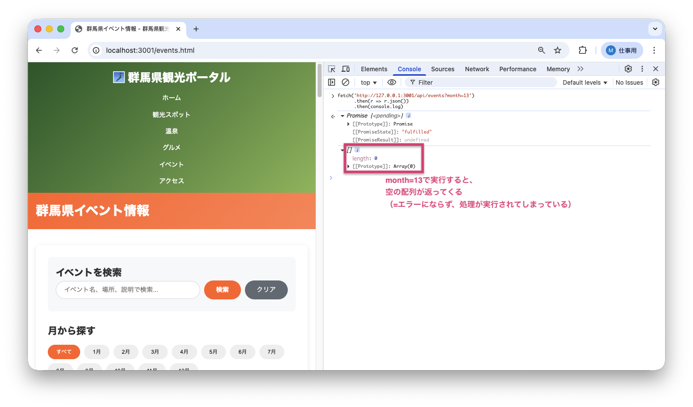
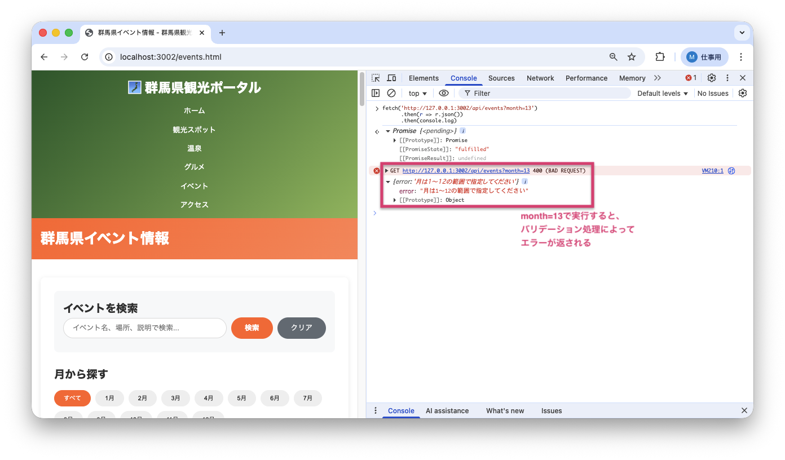

<!--
**姿勢 Attitude**
- より**具体的**に、明示する。Explain the issue **concretely**.
- **否定的**な言葉を使わなくても説明はできる。Explain the issue without **negative** sentence.
- 情報に**URL**があるならば書く。Write **URL** which indicates the information.
- 説明するよりも、**図示する**。**Image** is better than text.
 -->

## 画面・API (Page or API):
GET /api/events?month={month}

## 問題の簡単な説明 (Explain the problem):
月別イベント取得API（サーバーからデータを取得する仕組み）で、存在しない月（例: 13月、0月）を指定してもエラーが返されず、処理が実行されてしまいます。

## どうあるべきか (To be):
 - 月の入力値は1〜12の範囲でバリデーション（入力値のチェック）されるべきです。
 - 範囲外の値が指定された場合、適切なエラーメッセージが返されるべきです。

## 再現する手順 (Steps to reproduce the problem):
 1. ブラウザのコンソールで以下のコマンドを実行する:
    ```javascript
    fetch('http://127.0.0.1:3001/api/events?month=13')
      .then(r => r.json())
      .then(console.log)
    ```
 2. エラーが返されず、空の結果が返されることを確認
 3. `month=0`や`month=100`でも同様にエラーが返されないことを確認

## その他の情報 (Other information):
**該当コード箇所:**
`app/repositories/event_repository.py` 34-42行目付近

```python
def find_by_month(self, month):
    conn = get_db()
    cursor = conn.cursor()

    # 月の範囲チェックがない（13月なども受け付ける）
    month_str = f'{int(month):02d}'
    cursor.execute('''
        SELECT * FROM events
        WHERE substr(event_date, 6, 2) = ?
        ORDER BY event_date
    ''', (month_str,))
    # ...
```

**ヒント:**
- 月のバリデーションを追加する必要があります
- 例: `if not 1 <= int(month) <= 12: raise ValueError('月は1〜12の範囲で指定してください')`
- event_controller.pyでバリデーションを追加することも検討してください

※raise: エラーを発生させる命令

**バグ修正前の画面:**

13月を指定してもエラーが返されず、空の配列が返る：


**バグ修正後の画面:**

13月を指定すると適切なエラーメッセージが返る：


---

## プルリクエスト (Pull Request):

修正が完了したら、プルリクエストを作成してください。

**必須ラベル:**
- `level_3/B`

**PRタイトル例:**
```
[Level 3-B] 問題の簡単な説明
```
