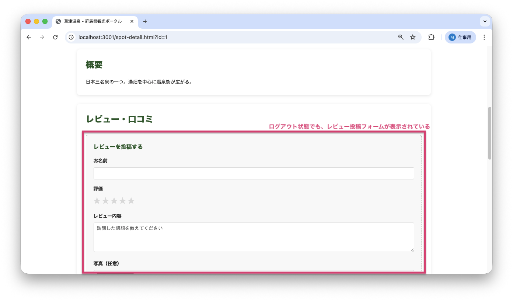
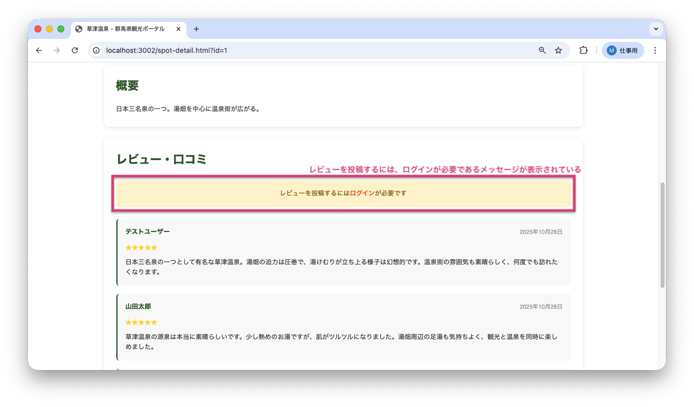

<!--
**姿勢 Attitude**
- より**具体的**に、明示する。Explain the issue **concretely**.
- **否定的**な言葉を使わなくても説明はできる。Explain the issue without **negative** sentence.
- 情報に**URL**があるならば書く。Write **URL** which indicates the information.
- 説明するよりも、**図示する**。**Image** is better than text.
 -->

## 画面・API (Page or API):
/spot-detail.html

## 問題の簡単な説明 (Explain the problem):
ログアウトした後も、レビュー投稿フォームが表示されたままになっています。ログインしていない状態でもレビューを投稿できるように見えます（実際には投稿はできません）。

## どうあるべきか (To be):
 - ログアウトすると、レビュー投稿フォームは非表示になり、「レビューを投稿するにはログインが必要です」というメッセージが表示されるべきです。
 - ログイン状態に応じてUI（画面表示）が適切に切り替わる必要があります。

## 再現する手順 (Steps to reproduce the problem):
 1. ブラウザで `/spot-detail.html?id=1` にアクセスする
 2. ログインする（ユーザーID: 4, パスワード: password789）
 3. レビュー投稿フォームが表示されることを確認
 4. spots.htmlに移動してログアウトする
 5. 再度 `/spot-detail.html?id=1` にアクセスする
 6. ログインしていないのに、レビュー投稿フォームが表示されていることを確認

## その他の情報 (Other information):
**該当コード箇所:**
`frontend/spot-detail.js` 25-39行目付近

```javascript
async function loadSpotDetails() {
    // ...
    // ログイン状態を確認せずに、常にフォームを表示してしまっている
    document.getElementById('loginNotice').style.display = 'none';
    document.getElementById('reviewForm').style.display = 'block';
    // ...
}
```

**ヒント:**
- `loadUserFromStorage()`（ローカルストレージからユーザー情報を読み込む関数）でログイン状態を確認してから、フォームの表示/非表示を制御する必要があります
- ログインしている場合:
  - `loginNotice`を非表示、`reviewForm`を表示
  - ユーザー名を自動入力して読み取り専用に設定
- ログインしていない場合:
  - `loginNotice`を表示、`reviewForm`を非表示

※関数: 特定の処理をまとめたもの

**バグ修正前の画面:**

ログアウト後もレビュー投稿フォームが表示されている：


**バグ修正後の画面:**

ログアウト後は「レビューを投稿するにはログインが必要です」と表示される：


---

## プルリクエスト (Pull Request):

修正が完了したら、プルリクエストを作成してください。

**必須ラベル:**
- `level_3/C`

**PRタイトル例:**
```
[Level 3-C] 問題の簡単な説明
```
