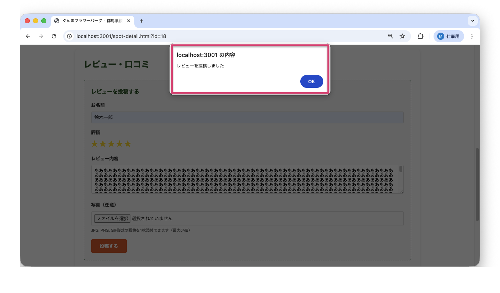
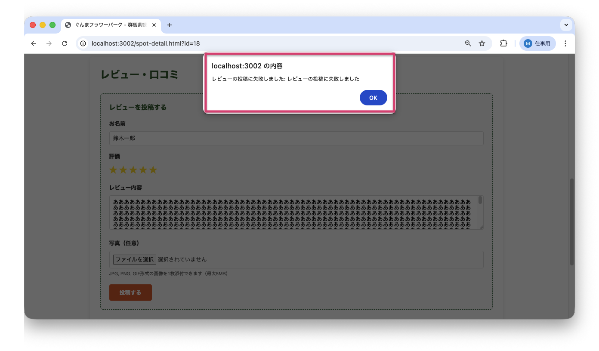

<!--
**姿勢 Attitude**
- より**具体的**に、明示する。Explain the issue **concretely**.
- **否定的**な言葉を使わなくても説明はできる。Explain the issue without **negative** sentence.
- 情報に**URL**があるならば書く。Write **URL** which indicates the information.
- 説明するよりも、**図示する**。**Image** is better than text.
 -->

## 画面・API (Page or API):
POST /api/reviews

## 問題の簡単な説明 (Explain the problem):
レビュー投稿API（サーバーにレビューを送信する仕組み）に文字数制限がなく、極端に長いレビュー（例: 10万文字）でも投稿できてしまいます。

## どうあるべきか (To be):
 - レビュー内容には適切な文字数制限（例: 1000文字以内）が設定されるべきです。
 - 文字数を超えた場合、エラーメッセージが返されるべきです。

## 再現する手順 (Steps to reproduce the problem):
 1. ブラウザで任意の観光地ページにアクセスする（例: `/spot-detail.html?id=1`）
    - まだレビューを投稿していない観光地であればどこでもOK
 2. ログインする（ユーザーID: 4, パスワード: password789）
 3. レビュー内容に非常に長い文章（1000文字以上）を入力する
    - 開発者コンソールで `copy('あ'.repeat(1500))` を実行してクリップボードにコピーし、レビュー入力欄に貼り付けます
 4. 星評価を選択して「投稿する」ボタンをクリックする
 5. エラーなく投稿できることを確認

## その他の情報 (Other information):
**該当コード箇所:**
`app/services/review_service.py` 39-40行目付近

```python
def create_review(self, review_data):
    # ...
    # 文字数制限チェックがない（10万文字でも投稿可能）
    # 本来は len(review_data['review_content']) > 1000 などでチェックすべき

    review_id = self.review_repo.create(review_data)
    # ...
```

**ヒント:**
- レビュー内容の長さをチェックするバリデーション（入力値チェック）を追加しましょう
- 例:
  ```python
  if len(review_data['review_content']) > 1000:
      return {'success': False, 'error': 'レビューは1000文字以内で入力してください'}
  ```

※return: 関数の実行を終了して値を返す命令

**バグ修正前の画面:**

1000文字以上のレビューでもエラーなく投稿できてしまう：


**バグ修正後の画面:**

1000文字以上のレビューを投稿しようとするとエラーメッセージが表示される：


---

## プルリクエスト (Pull Request):

修正が完了したら、プルリクエストを作成してください。

**必須ラベル:**
- `level_3/F`

**PRタイトル例:**
```
[Level 3-F] 問題の簡単な説明
```
