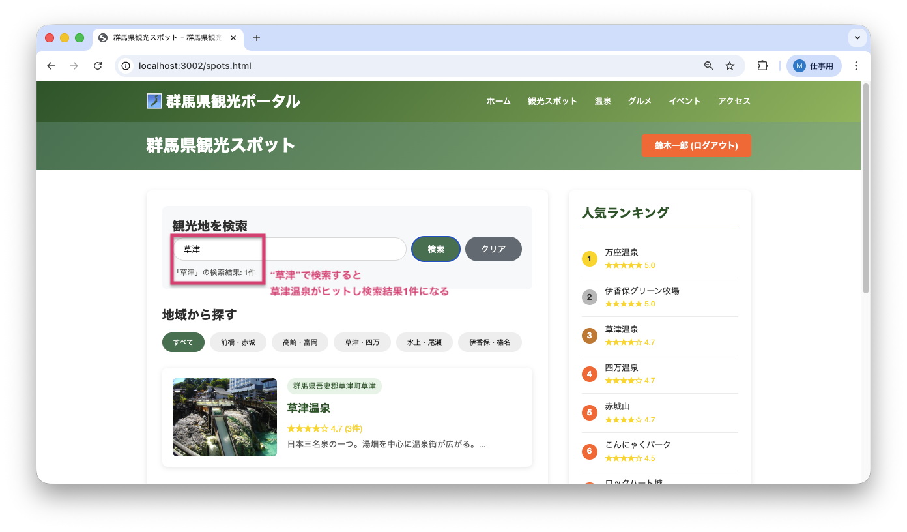

<!--
**姿勢 Attitude**
- より**具体的**に、明示する。Explain the issue **concretely**.
- **否定的**な言葉を使わなくても説明はできる。Explain the issue without **negative** sentence.
- 情報に**URL**があるならば書く。Write **URL** which indicates the information.
- 説明するよりも、**図示する**。**Image** is better than text.
 -->

## 画面・API (Page or API):
GET /api/spots/search

## 問題の簡単な説明 (Explain the problem):
観光地検索機能で、ワイルドカード（あいまい検索で使う記号）`%`とGLOB演算子（パターンマッチングを行うSQL演算子）の組み合わせが不適切なため、検索が正しく機能しません。

## どうあるべきか (To be):
 - GLOB演算子を使う場合は`*`をワイルドカードとして使用するか、LIKE演算子（あいまい検索を行うSQL演算子）を使う場合は`%`をワイルドカードとして使用する必要があります。
 - 一般的には、LIKE演算子と`%`の組み合わせが推奨されます（大文字小文字を区別しない検索が可能）。

## 再現する手順 (Steps to reproduce the problem):
 1. ブラウザで `/spots.html` にアクセスする
 2. 検索ボックスに「草津」と入力して検索する
 3. 検索結果が0件になることを確認（本来は草津温泉がヒットすべき）

## その他の情報 (Other information):
**該当コード箇所:**
`app/repositories/spot_repository.py` 62-67行目付近

```python
def find_by_keyword(self, keyword):
    # ...
    # ワイルドカードに % を使っているが、演算子がGLOBになっている
    search_keyword = f'%{keyword}%'  # LIKEのワイルドカード
    cursor.execute('''
        SELECT * FROM tourist_spots
        WHERE spot_name GLOB ? OR description GLOB ? OR address GLOB ?  # GLOBは * をワイルドカードとして使う
        ORDER BY spot_id
    ''', (search_keyword, search_keyword, search_keyword))
    # ...
```

**ヒント:**
- SQLiteの`GLOB`演算子は`*`をワイルドカードとして使います（例: `*keyword*`）
- SQLiteの`LIKE`演算子は`%`をワイルドカードとして使います（例: `%keyword%`）
- 現在のコードは`%`を使っているのに`GLOB`演算子を使用しているため、ワイルドカードが機能していません
- `GLOB`を`LIKE`に変更することで修正できます（ワイルドカードの変更は不要）
- 修正例:
  ```python
  search_keyword = f'%{keyword}%'
  cursor.execute('''
      SELECT * FROM tourist_spots
      WHERE spot_name LIKE ? OR description LIKE ? OR address LIKE ?
      ORDER BY spot_id
  ''', (search_keyword, search_keyword, search_keyword))
  ```

※cursor.execute: データベースに対してSQL文を実行する命令

**バグ修正前の画面:**

「草津」で検索しても0件になる：


**バグ修正後の画面:**

「草津」で検索すると正しく結果が表示される：


---

## プルリクエスト (Pull Request):

修正が完了したら、プルリクエストを作成してください。

**必須ラベル:**
- `level_3/H`

**PRタイトル例:**
```
[Level 3-H] 問題の簡単な説明
```
