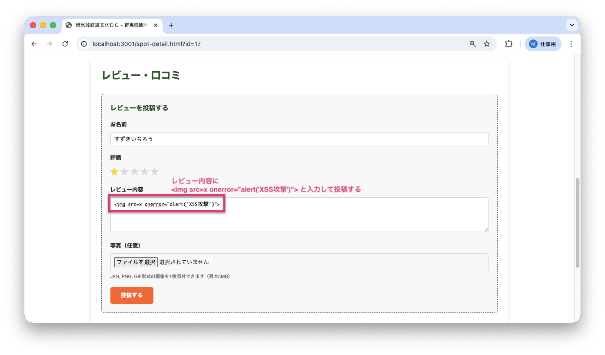
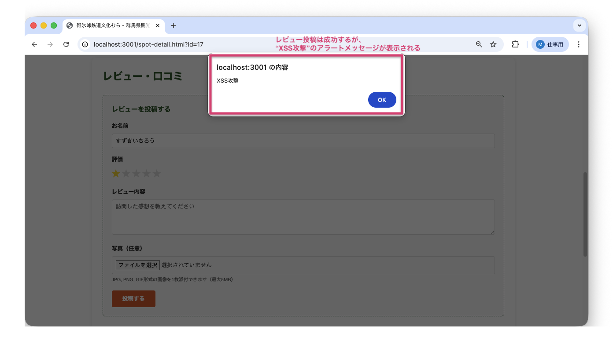
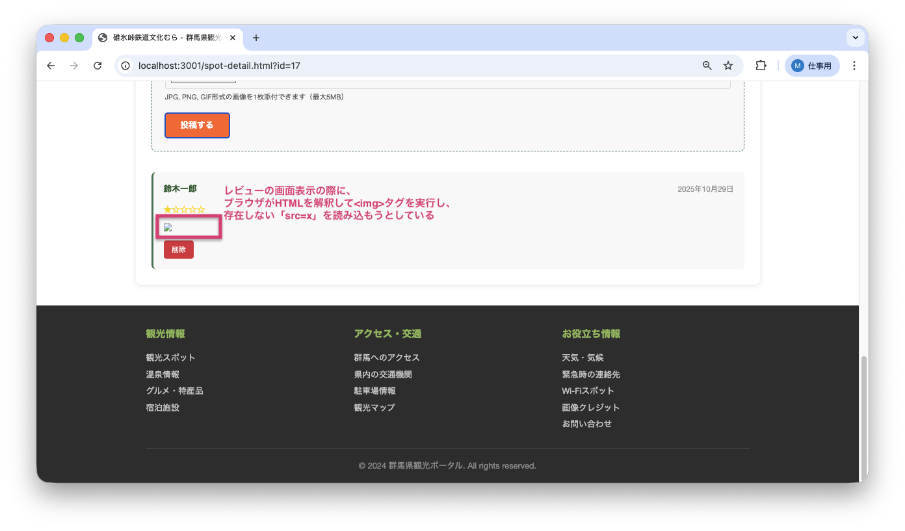
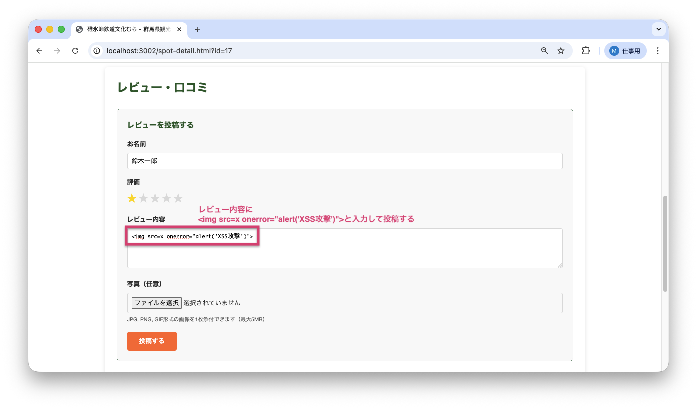
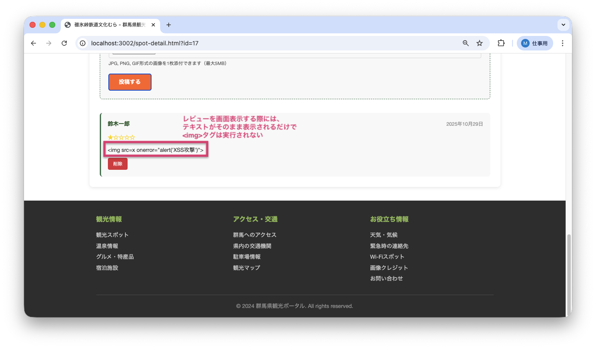

<!--
**姿勢 Attitude**
- より**具体的**に、明示する。Explain the issue **concretely**.
- **否定的**な言葉を使わなくても説明はできる。Explain the issue without **negative** sentence.
- 情報に**URL**があるならば書く。Write **URL** which indicates the information.
- 説明するよりも、**図示する**。**Image** is better than text.
 -->

## 画面・API (Page or API):
/spot-detail.html

## 問題の簡単な説明 (Explain the problem):
レビュー投稿機能にXSS（クロスサイトスクリプティング：悪意のあるスクリプトを埋め込んで実行させる攻撃手法）の脆弱性が存在します。レビュー内容に悪意のあるHTMLコードを投稿すると、そのスクリプトが実行されてしまいます。

## どうあるべきか (To be):
 - ユーザーが入力したレビュー内容は、HTMLタグとして解釈されず、テキストとして安全に表示されるべきです。
 - 悪意のあるコードを入力した場合、スクリプトは実行されず、そのままテキストとして表示される必要があります。

## 再現する手順 (Steps to reproduce the problem):
 1. ブラウザで `/spot-detail.html?id=17` にアクセスする
 2. ログインする（ユーザーID: 4, パスワード: password789）
 3. レビュー内容に `` と入力する
 4. 星評価を選択して「投稿する」ボタンをクリックする
 5. アラートが表示されることを確認（XSSが成功）

## その他の情報 (Other information):
**該当コード箇所:**
`frontend/spot-detail.js` 156-169行目付近

```javascript
async function loadReviews() {
    // ...
    reviews.forEach(review => {
        // ...
        // 中級バグ#3: XSS脆弱性（review_contentをエスケープせずにHTMLに挿入）
        const reviewHtml = `
            <div class="review-item" data-review-id="${review.review_id}">
                <div class="review-header">
                    <span class="reviewer-name">${review.user_name}</span>
                    <span class="review-date">${dateStr}</span>
                </div>
                <div class="review-rating">${'★'.repeat(review.rating)}${'☆'.repeat(5 - review.rating)}</div>
                <div class="review-text">${review.review_content}</div>
                ${photoHtml}
                ${deleteButtonHtml}
            </div>
        `;
        reviewsList.insertAdjacentHTML('beforeend', reviewHtml);
    });
}
```

**ヒント:**
- `innerHTML`や`insertAdjacentHTML`を使うと、HTMLタグが解釈されてしまいます
- `textContent`を使うか、HTMLエスケープ関数を作成してデータをサニタイズ（無害化）する必要があります
- stats.jsの`escapeHtml`関数を参考にできます

**参考URL:**
- https://developer.mozilla.org/ja/docs/Glossary/Cross-site_scripting

**バグ修正前の画面:**

レビュー投稿時：


XSS攻撃のアラートが表示される：


投稿済レビュー（悪意のあるコードが実行されている）：


**バグ修正後の画面:**

レビュー投稿時（修正前と同じ）：


投稿済レビュー（テキストとして安全に表示されている）：


---

## プルリクエスト (Pull Request):

修正が完了したら、プルリクエストを作成してください。

**必須ラベル:**
- `level_4/A`

**PRタイトル例:**
```
[Level 4-A] 問題の簡単な説明
```
