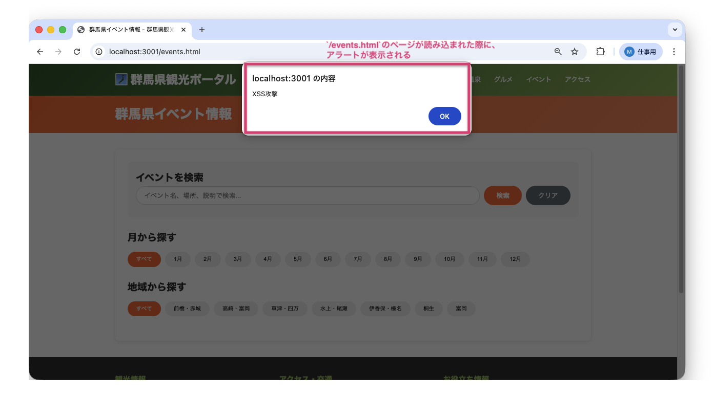
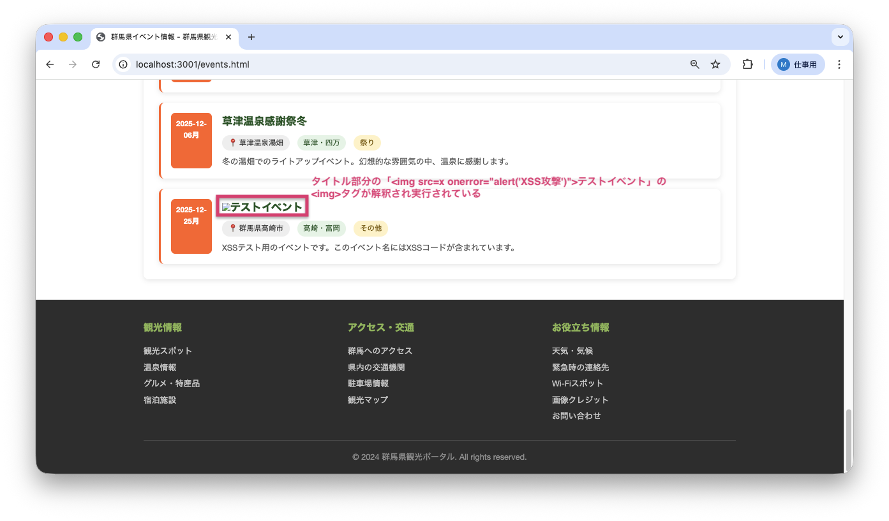
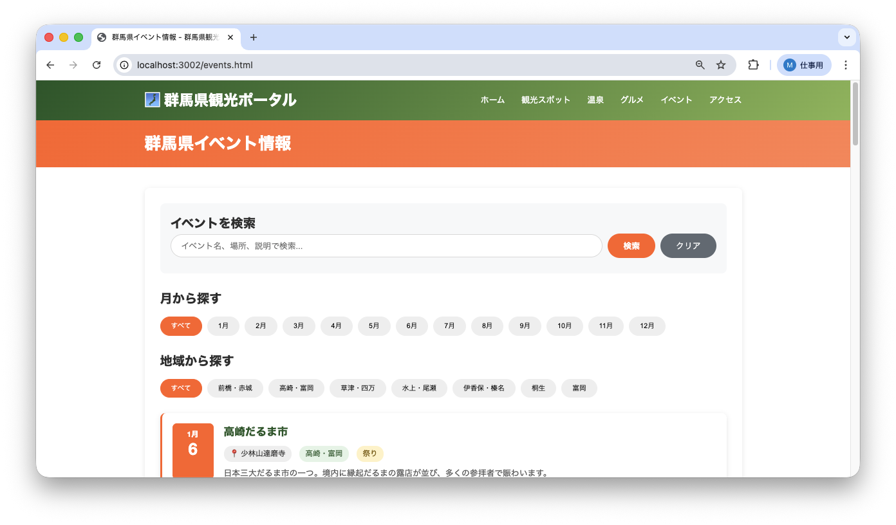
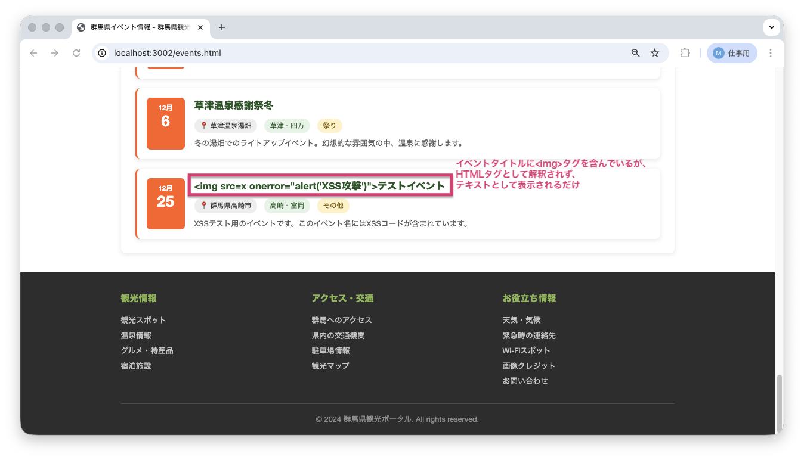

<!--
**姿勢 Attitude**
- より**具体的**に、明示する。Explain the issue **concretely**.
- **否定的**な言葉を使わなくても説明はできる。Explain the issue without **negative** sentence.
- 情報に**URL**があるならば書く。Write **URL** which indicates the information.
- 説明するよりも、**図示する**。**Image** is better than text.
 -->

## 画面・API (Page or API):
/events.html

## 問題の簡単な説明 (Explain the problem):
イベント名表示機能にXSS（クロスサイトスクリプティング：悪意のあるスクリプトを埋め込んで実行させる攻撃手法）の脆弱性が存在します。データベースのイベント名に`<script>`タグが含まれている場合、そのスクリプトが実行されてしまいます。

## どうあるべきか (To be):
 - イベント名は、HTMLタグとして解釈されず、テキストとして安全に表示されるべきです。
 - 悪意のあるスクリプトが実行されないようにする必要があります。

## 再現する手順 (Steps to reproduce the problem):
 1. ブラウザで `/events.html` にアクセスする
 2. ページが読み込まれると同時にアラートが表示される
 3. アラートを閉じると、イベント一覧が表示される
 4. 12月のイベント「テストイベント」のタイトル部分を確認する

## その他の情報 (Other information):
**該当コード箇所:**
`frontend/events.js` 57-72行目付近

```javascript
function displayEvents(events) {
    events.forEach(event => {
        // ...
        // 中級バグ#4: XSS脆弱性（event_nameをエスケープせずにHTMLに挿入）
        eventElement.innerHTML = `
            <div class="event-date-box">
                <div class="event-month">${month}月</div>
                <div class="event-day">${day}</div>
            </div>
            <div class="event-info">
                <h3>${event.event_name}</h3>
                <div class="event-meta">
                    <span class="event-location">📍 ${event.location}</span>
                    <span class="event-area">${areaDisplay}</span>
                    <span class="event-category">${event.category}</span>
                </div>
                <p class="event-description">${event.description}</p>
            </div>
        `;
        eventsGrid.appendChild(eventElement);
    });
}
```

**ヒント:**
- `innerHTML`を使うと、HTMLタグが解釈されてしまいます
- `textContent`を使うか、HTMLエスケープ関数でデータをサニタイズ（無害化）する必要があります
- stats.jsの`escapeHtml`関数を参考にできます

**参考URL:**
- https://developer.mozilla.org/ja/docs/Glossary/Cross-site_scripting

**バグ修正前の画面:**

ページアクセス時にアラートが表示される：


イベント一覧（``タグがHTML解釈されている）：


**バグ修正後の画面:**

ページアクセス時（アラートは表示されない）：


イベント一覧（``タグがテキストとして安全に表示されている）：


---

## プルリクエスト (Pull Request):

修正が完了したら、プルリクエストを作成してください。

**必須ラベル:**
- `level_4/B`

**PRタイトル例:**
```
[Level 4-B] 問題の簡単な説明
```
