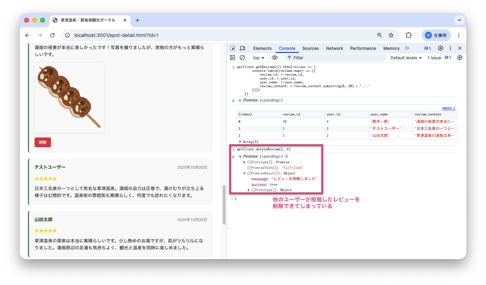
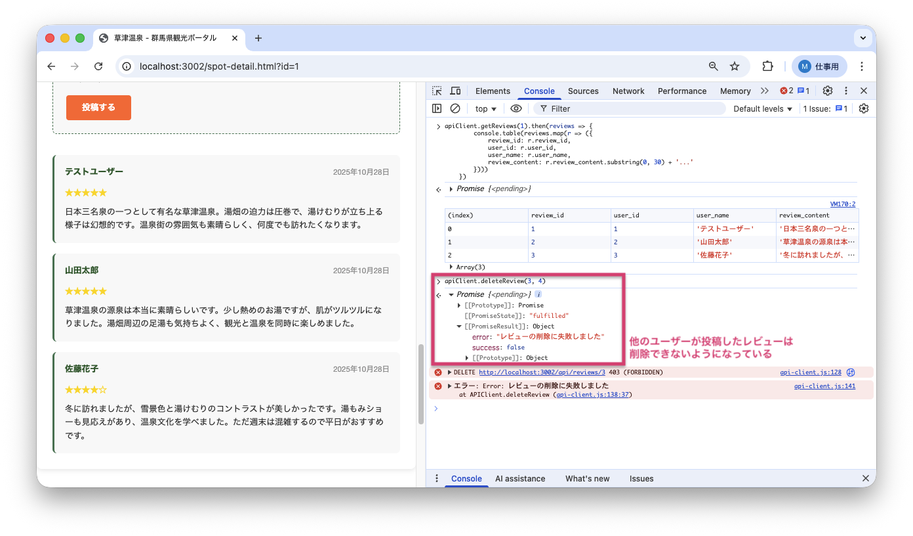

<!--
**姿勢 Attitude**
- より**具体的**に、明示する。Explain the issue **concretely**.
- **否定的**な言葉を使わなくても説明はできる。Explain the issue without **negative** sentence.
- 情報に**URL**があるならば書く。Write **URL** which indicates the information.
- 説明するよりも、**図示する**。**Image** is better than text.
 -->

## 画面・API (Page or API):
DELETE /api/reviews/{review_id}

## 問題の簡単な説明 (Explain the problem):
レビュー削除APIに権限チェックの不備があり、他のユーザーが投稿したレビューも削除できてしまいます。

## どうあるべきか (To be):
 - レビュー削除は、そのレビューを投稿したユーザー本人のみが実行できるべきです。
 - 他人のレビューを削除しようとした場合、エラーメッセージが返されるべきです。

## 再現する手順 (Steps to reproduce the problem):
 1. ブラウザで `/spot-detail.html?id=1` にアクセスする
 2. ユーザーID: 4、パスワード: password789 でログインする
 3. 開発者ツールのコンソールで以下を実行して、他のユーザーのレビューIDを確認:
    ```javascript
    apiClient.getReviews(1).then(reviews => {
        console.table(reviews.map(r => ({
            review_id: r.review_id,
            user_id: r.user_id,
            user_name: r.user_name,
            review_content: r.review_content.substring(0, 30) + '...'
        })))
    })
    ```
 4. user_id が 4 以外のレビューを見つける（例: review_id=3, user_id=1）
 5. 開発者ツールのコンソールで以下を実行して、他人のレビューを削除:
    ```javascript
    apiClient.deleteReview(3, 4)  // review_id=3 を user_id=4 で削除
    ```
 6. レビューが削除されることを確認（画面をリロードすると消えている）
 7. 本来、他のユーザーのレビューは削除できないべき

## その他の情報 (Other information):
**該当コード箇所:**
`app/services/review_service.py` 132-134行目付近

```python
def delete_review(self, review_id, user_id):
    review = self.review_repo.find_by_id(review_id)

    if not review:
        return {'success': False, 'error': 'レビューが見つかりません'}

    # 権限チェックが実装されていない（他人のレビューも削除可能）

    # ...削除処理...
```

**ヒント:**
- レビューの投稿者とリクエストしたユーザーのIDを比較する必要があります
- `review['user_id']` と `user_id` を比較して、一致しない場合はエラーを返しましょう
- セキュリティの基本: 認可（Authorization：操作する権限があるかのチェック）は必須です

**バグ修正前の画面:**

他人のレビューを削除できてしまう（成功メッセージが返る）：


**バグ修正後の画面:**

他人のレビューを削除しようとするとエラーメッセージが返る：


---

## プルリクエスト (Pull Request):

修正が完了したら、プルリクエストを作成してください。

**必須ラベル:**
- `level_4/C`

**PRタイトル例:**
```
[Level 4-C] 問題の簡単な説明
```
