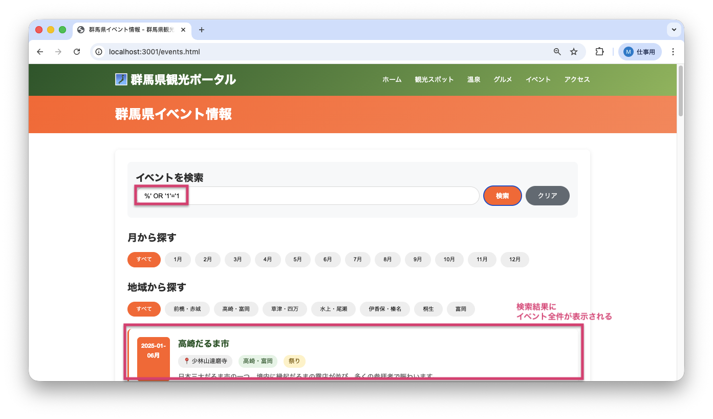
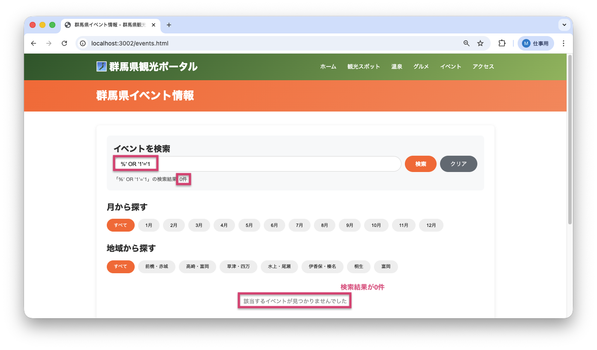

<!--
**姿勢 Attitude**
- より**具体的**に、明示する。Explain the issue **concretely**.
- **否定的**な言葉を使わなくても説明はできる。Explain the issue without **negative** sentence.
- 情報に**URL**があるならば書く。Write **URL** which indicates the information.
- 説明するよりも、**図示する**。**Image** is better than text.
 -->

## 画面・API (Page or API):
GET /api/events/search

## 問題の簡単な説明 (Explain the problem):
イベント検索APIにSQLインジェクション（SQL文を不正に挿入してデータベースを操作する攻撃手法）の脆弱性が存在します。検索キーワードに悪意のあるSQL文を含めることで、データベースに対して意図しない操作が可能になります。

## どうあるべきか (To be):
 - 検索キーワードは、SQLクエリに直接埋め込まれず、プレースホルダーを使って安全に処理されるべきです。
 - ユーザー入力がSQL文として解釈されないようにする必要があります。

## 再現する手順 (Steps to reproduce the problem):
 1. ブラウザで `/events.html` にアクセスする
 2. 検索ボックスに `%' OR '1'='1` と入力する
 3. 「検索」ボタンをクリックする
 4. 全てのイベントが表示されることを確認（本来は検索条件に一致するものだけ）

## その他の情報 (Other information):
**該当コード箇所:**
`app/repositories/event_repository.py` 79-87行目付近

```python
def find_by_keyword(self, keyword):
    conn = get_db()
    cursor = conn.cursor()

    # 中級バグ#1: SQLインジェクション脆弱性
    query = f'''
        SELECT * FROM events
        WHERE event_name LIKE '%{keyword}%'
           OR location LIKE '%{keyword}%'
           OR description LIKE '%{keyword}%'
        ORDER BY event_date
    '''
    cursor.execute(query)
    # ...
```

**ヒント:**
- f-stringで直接SQLにユーザー入力を埋め込むのは危険です
- プレースホルダー（`?`）を使って、パラメータを安全に渡す必要があります
- **重要**: `%{keyword}%` のようにPythonで文字列連結してからプレースホルダーに渡すのは不十分です
- 正しい方法: SQL内で `'%' || ? || '%'` として連結し、`keyword` をそのままプレースホルダーに渡す
- 例:
  ```python
  cursor.execute('''
      SELECT * FROM events
      WHERE event_name LIKE '%' || ? || '%'
         OR location LIKE '%' || ? || '%'
         OR description LIKE '%' || ? || '%'
      ORDER BY event_date
  ''', (keyword, keyword, keyword))
  ```

**参考URL:**
- https://www.ipa.go.jp/security/vuln/websecurity/sql.html

**バグ修正前の画面:**

SQLインジェクション攻撃により全イベント（21件）が表示される：


**バグ修正後の画面:**

SQLインジェクション攻撃が防がれ、0件が表示される：


---

## プルリクエスト (Pull Request):

修正が完了したら、プルリクエストを作成してください。

**必須ラベル:**
- `level_4/D`

**PRタイトル例:**
```
[Level 4-D] 問題の簡単な説明
```
