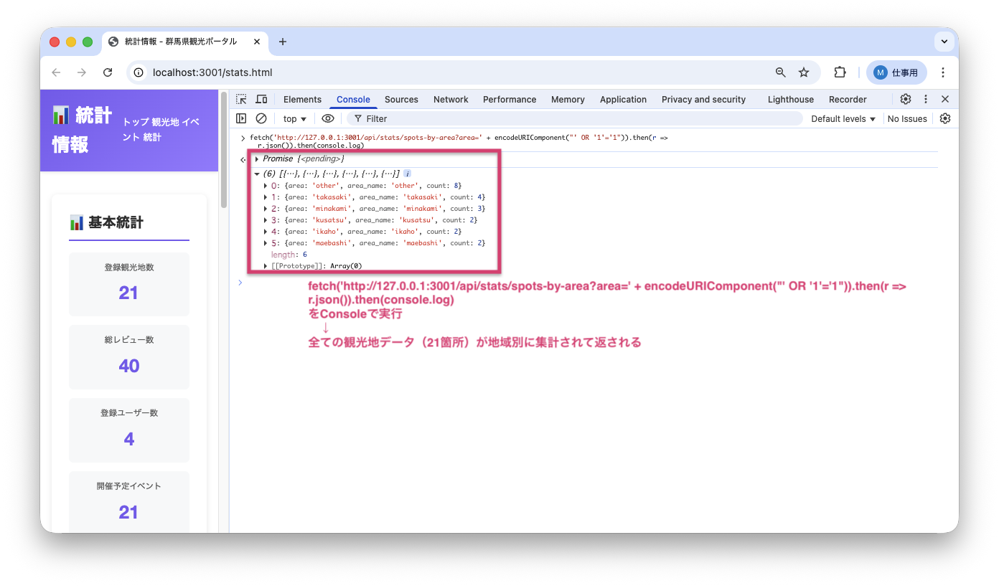
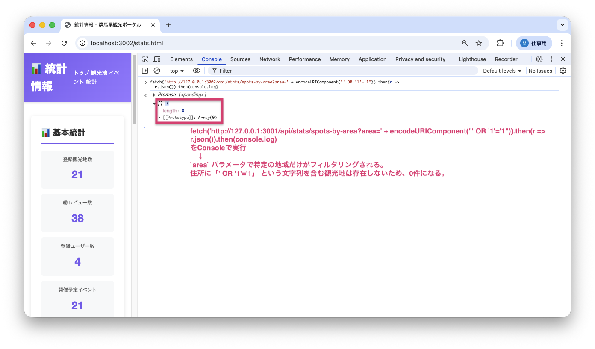

<!--
**姿勢 Attitude**
- より**具体的**に、明示する。Explain the issue **concretely**.
- **否定的**な言葉を使わなくても説明はできる。Explain the issue without **negative** sentence.
- 情報に**URL**があるならば書く。Write **URL** which indicates the information.
- 説明するよりも、**図示する**。**Image** is better than text.
 -->

## 画面・API (Page or API):
GET /api/stats/spots-by-area

## 問題の簡単な説明 (Explain the problem):
統計APIのエリアフィルター機能にSQLインジェクション（SQL文を不正に挿入してデータベースを操作する攻撃手法）の脆弱性が存在します。エリアパラメータに悪意のあるSQL文を含めることで、データベースに対して意図しない操作が可能になります。

## どうあるべきか (To be):
 - エリアパラメータは、SQLクエリに直接埋め込まれず、プレースホルダーを使って安全に処理されるべきです。
 - ユーザー入力がSQL文として解釈されないようにする必要があります。

## 再現する手順 (Steps to reproduce the problem):
 1. ブラウザで `/stats.html` にアクセスする
 2. 開発者ツールのコンソールで以下のコマンドを実行する:
    ```javascript
    fetch('http://127.0.0.1:3001/api/stats/spots-by-area?area=' + encodeURIComponent("' OR '1'='1")).then(r => r.json()).then(console.log)
    ```
 3. 全ての観光地データ（21箇所）が地域別に集計されて返されることを確認
 4. 本来は `area` パラメータで特定の地域だけがフィルタリングされるべき

## その他の情報 (Other information):
**該当コード箇所:**
`app/repositories/stats_repository.py` 44-46行目付近

```python
def fetch_spots_by_area(self, area_filter=None):
    conn = get_db()
    cursor = conn.cursor()

    if area_filter:
        # SQLインジェクション: エリアフィルタの脆弱性
        query = f"SELECT spot_id FROM tourist_spots WHERE address LIKE '%{area_filter}%'"
        cursor.execute(query)
        # ...
```

**ヒント:**
- f-stringで直接SQLにユーザー入力を埋め込むのは危険です
- プレースホルダー（`?`）を使って、パラメータを安全に渡す必要があります
- **重要**: `f'%{area_filter}%'` のようにPythonで文字列連結してからプレースホルダーに渡すのは不十分です
- 正しい方法: SQL内で `'%' || ? || '%'` として連結し、`area_filter` をそのままプレースホルダーに渡す
- **注意**: このバグを修正するには、以下の3つのファイルを修正する必要があります：
  1. `app/controllers/stats_controller.py`: `request.args.get('area')` でパラメータを取得
  2. `app/services/stats_service.py`: `area_filter` パラメータを受け取ってリポジトリに渡す
  3. `app/repositories/stats_repository.py`: プレースホルダーを使ってSQLインジェクションを防ぐ
- 例（リポジトリ層のみ）:
  ```python
  query = "SELECT spot_id FROM tourist_spots WHERE address LIKE '%' || ? || '%'"
  cursor.execute(query, (area_filter,))
  ```

**参考URL:**
- https://www.ipa.go.jp/security/vuln/websecurity/sql.html

**バグ修正前の画面:**

SQLインジェクション攻撃により全観光地データ（21箇所）が地域別に集計されて返される：


**バグ修正後の画面:**

SQLインジェクション攻撃が防がれ、空の配列（0件）が返される：


---

## プルリクエスト (Pull Request):

修正が完了したら、プルリクエストを作成してください。

**必須ラベル:**
- `level_4/E`

**PRタイトル例:**
```
[Level 4-E] 問題の簡単な説明
```
