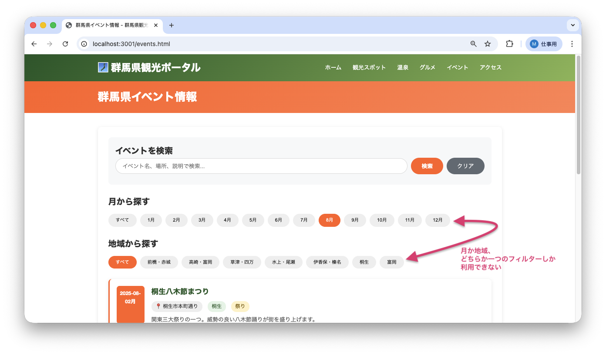
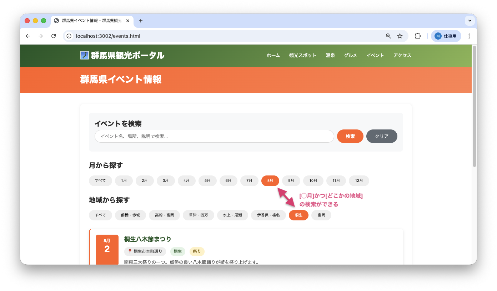

<!--
**姿勢 Attitude**
- より**具体的**に、明示する。Explain the issue **concretely**.
- **否定的**な言葉を使わなくても説明はできる。Explain the issue without **negative** sentence.
- 情報に**URL**があるならば書く。Write **URL** which indicates the information.
- 説明するよりも、**図示する**。**Image** is better than text.
 -->

## 画面・API (Page or API):
/events.html

## 問題の簡単な説明 (Explain the problem):
イベント一覧ページで、月別フィルターと地域別フィルターを同時に使用できません。例えば「8月」で絞り込んだ後に「桐生」で絞り込むと、月の選択がリセットされてしまいます。

## どうあるべきか (To be):
 - 月別フィルターと地域別フィルターを同時に適用できるべきです。
 - 「8月」かつ「桐生」のように、両方の条件を満たすイベントのみが表示されるべきです。

## 再現する手順 (Steps to reproduce the problem):
 1. ブラウザで `/events.html` にアクセスする
 2. 「月から探す」で「8月」をクリックする
 3. 8月のイベントのみが表示されることを確認
 4. 「地域から探す」で「桐生」をクリックする
 5. 月の選択が「すべて」にリセットされ、桐生の全イベント（8月以外も含む）が表示されることを確認

## その他の情報 (Other information):
**該当コード箇所:**
`frontend/events.js` 79-137行目付近

```javascript
async function filterByMonth(month, clickedButton) {
    // ...
    // バグ: 地域フィルターをリセットしているため、同時に使えない
    areaButtons.forEach(btn => btn.classList.remove('active'));
    areaButtons[0].classList.add('active');

    currentFilter = { type: 'month', value: month };
    // ...
}

async function filterByArea(area, clickedButton) {
    // ...
    // バグ: 月別フィルターをリセットしているため、同時に使えない
    monthButtons.forEach(btn => btn.classList.remove('active'));
    monthButtons[0].classList.add('active');

    currentFilter = { type: 'area', value: area };
    // ...
}
```

**ヒント:**

この問題を解決するには、**フロントエンドとバックエンドの両方**を修正する必要があります。

### フロントエンドの修正（3ファイル）

**1. `frontend/events.js`**
- `currentFilter`の構造を変更: `{ type: 'month', value: month }` → `{ month: 'all', area: 'all' }`
- `filterByMonth`関数: 地域ボタンをリセットする処理を削除し、`currentFilter.month`のみ更新
- `filterByArea`関数: 月ボタンをリセットする処理を削除し、`currentFilter.area`のみ更新
- 両方のフィルター値に応じて、適切なAPIを呼び出す分岐処理を追加

**2. `frontend/api-client.js`**
- 月と地域の両方でフィルターするための新しいメソッド `getEventsByMonthAndArea(month, area)` を追加

### バックエンドの修正（3ファイル）

現在のバックエンドは、monthとareaパラメータのどちらか一方しか処理できません（`if-elif`構造）。両方を同時に処理できるようにする必要があります。

**3. `app/controllers/event_controller.py`**
- `get_events`関数の条件分岐を修正: `if month and area:` のケースを追加

**4. `app/services/event_service.py`**
- 新しいメソッド `get_events_by_month_and_area(month, area)` を追加

**5. `app/repositories/event_repository.py`**
- 新しいメソッド `find_by_month_and_area(month, area)` を追加
- WHERE句で月と地域の両方を条件にするSQLクエリを実装

### 参考
- 既存の`find_by_month`や`find_by_area`メソッドを参考にしてください
- WHERE句で複数条件を指定する場合は `AND` を使います

**バグ修正前の画面:**

8月を選択後に桐生を選択すると、月の選択がリセットされる：


**バグ修正後の画面:**

8月と桐生の両方の条件を満たすイベントが表示される：


---

## プルリクエスト (Pull Request):

修正が完了したら、プルリクエストを作成してください。

**必須ラベル:**
- `level_5/G`

**PRタイトル例:**
```
[Level 5-G] 問題の簡単な説明
```
